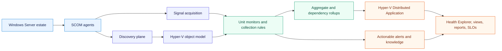
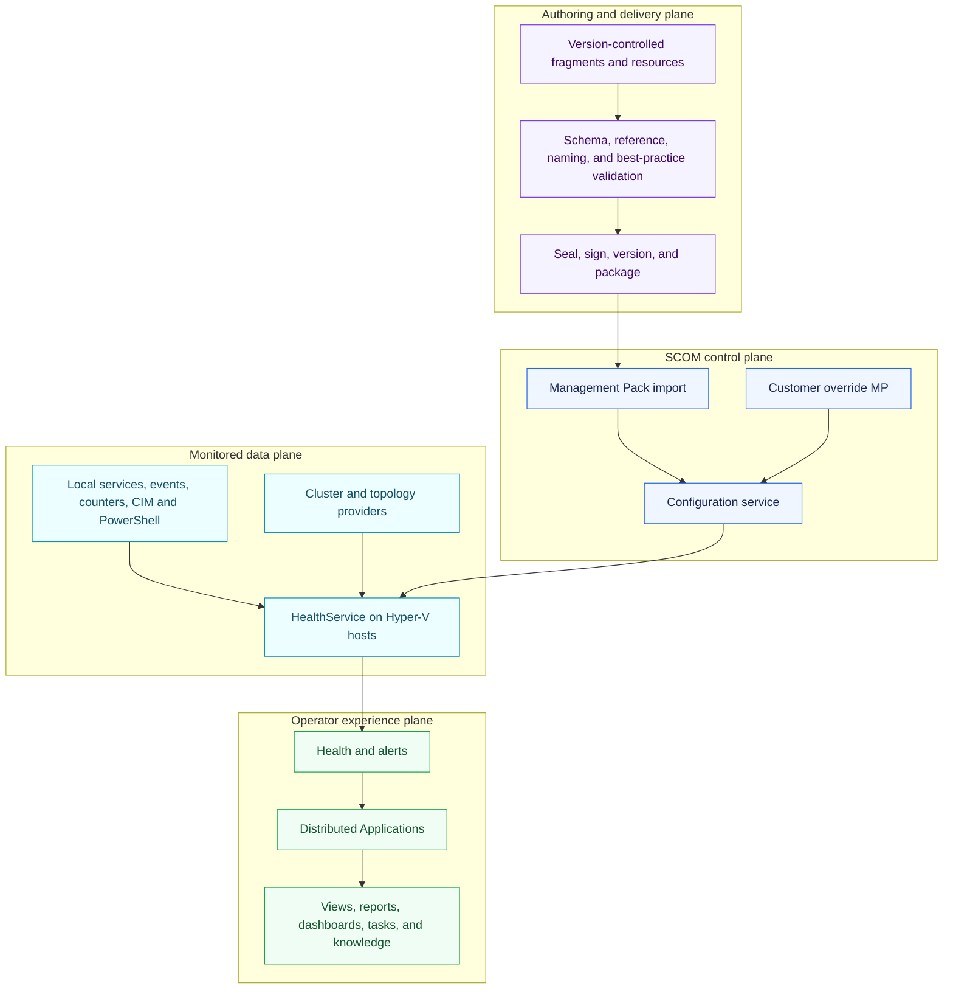
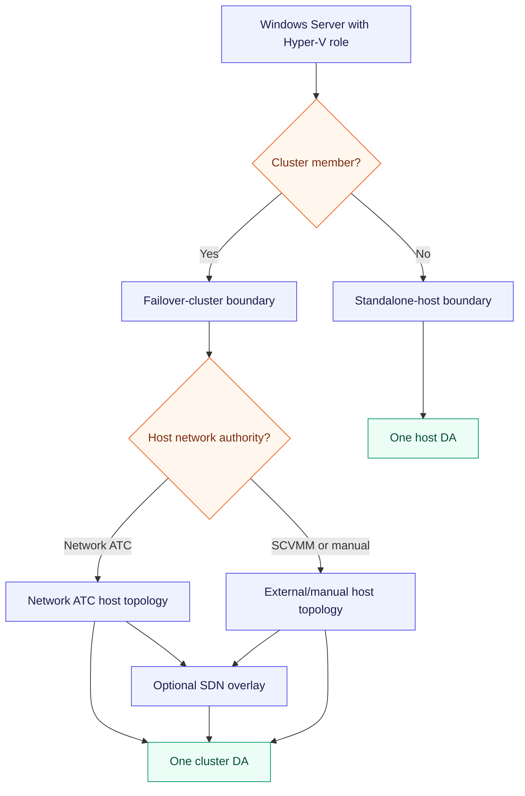
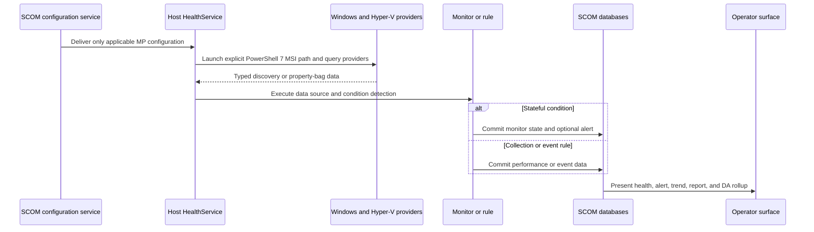

# Hyper-V SCOM architecture

The Hyper-V System Center Operations Manager (SCOM) product is an independent, sealed Management
Pack suite that discovers supported standalone hosts and failover clusters, evaluates their health,
and presents one service-oriented Distributed Application (DA) for each monitored boundary. This
page is the architecture map; the linked pages define each contract in implementation detail.

The design follows Microsoft's Management Pack model: classes represent managed objects,
discoveries create their instances, monitors establish health, rules collect or react to data,
Run As profiles provide explicitly assigned credentials, and views, knowledge, reports, and tasks
complete the operator experience. See [What is in an Operations Manager management pack?](https://learn.microsoft.com/en-us/system-center/scom/manage-overview-management-pack?view=sc-om-2025).

## Architecture at a glance

## Design goals

- Cover supported standalone Hyper-V hosts, Windows Server Failover Clusters, and explicitly
  approved SCVMM/SDN-managed variants without assuming Azure connectivity.
- Make topology and ownership first-class so alerts identify the affected host, cluster, virtual
  machine (VM), storage, or network component.
- Produce useful health with low alert noise, explicit recovery, maintenance awareness, and no
  silent Healthy state when telemetry is stale.
- Keep agent, management-server, operational-database, and data-warehouse cost within documented
  budgets at the supported maximum scale.
- Ship operator-ready knowledge, views, diagnostics, reports, service-level objective (SLO)
  targets, overrides, upgrade guidance, and self-monitoring.
- Remain independently installable, upgradeable, and removable from the Azure Local SCOM product
  and the Microsoft Hyper-V 2019 Management Pack.

## Architectural planes

## Supported topology shapes

The architecture supports multiple shapes through explicit topology classification. Optional
branches are discovered only when their authority and prerequisites are proven.

Network ATC is the preferred host-network baseline for eligible Windows Server 2025 Datacenter
Hyper-V clusters. It may coexist with Windows Server SDN, whose Network Controller owns overlay and
policy resources, and with VMM as orchestrator. The MP must prevent duplicate ownership and health
membership for the same object; it must not collapse distinct layers into one exclusive choice.

## Runtime data flow

First-party script workflows do not use SCOM's implicit in-process Windows PowerShell host. Public
`System.Library` command executors launch `%ProgramFiles%\PowerShell\7\pwsh.exe`; discovery and
property-bag scripts return native SCOM data through `MOM.ScriptAPI.Return`. The machine-wide MSI
installation and runtime-evidence gate are defined by
[ADR 0047](../decisions/0047-hyper-v-v2-explicit-powershell-7-execution.md).

## Document map

| Contract | Design document |
|---|---|
| Product boundaries, requirements, and runtime planes | This page |
| Sealed MP decomposition and dependency graph | [Management Pack structure](management-pack-structure.md) |
| Classes, keys, hosting, containment, and mobility | [Class and relationship model](class-and-relationship-model.md) |
| Staged discovery, data sources, cookdown, and workflow placement | [Discovery and workflow architecture](discovery-and-workflow-architecture.md) |
| Health dimensions, state, alerting, recovery, and suppression | [Health and alert architecture](health-and-alert-architecture.md) |
| Service roots, DA membership, and dependency rollup | [Distributed Application](distributed-application.md) |
| Naming, localization, knowledge, overrides, and authoring rules | [Authoring standards](authoring-standards.md) |
| Least privilege, execution boundaries, and self-observability | [Security and operability](security-and-operability.md) |
| Static, lab, scale, lifecycle, and release gates | [Validation and release](validation-and-release.md) |

## Non-functional requirements

| Attribute | Required design behavior | Acceptance evidence |
|---|---|---|
| Reliability | No single script failure may falsely mark the platform Healthy | Fault injection and stale-data tests |
| Scale | Workflow and data-volume budgets defined by target class and interval | Maximum-fixture performance test |
| Performance | Expensive providers queried once and shared through cookdown where safe | Workflow trace and HealthService measurements |
| Security | Local least privilege first; explicit Run As only where proven necessary | Permission matrix and negative-access tests |
| Maintainability | Stable IDs, modular fragments, product knowledge, and traceable catalog rows | Static analysis and design review |
| Upgrade safety | Stable class keys and element IDs; additive change preferred | In-place upgrade and override-preservation tests |
| Operability | Every alert explains impact, evidence, validation, remediation, and recovery | Knowledge-content quality gate |
| Portability | No Azure Local or legacy Hyper-V MP runtime dependency | Reference-graph and side-by-side import tests |

## Decision status

This is the accepted implementation baseline governed by ADRs 0022, 0025–0029, 0031, and
0040–0047. Runtime support remains conditional on the representative validation and release gates;
accepted architecture is not a substitute for lab evidence.
