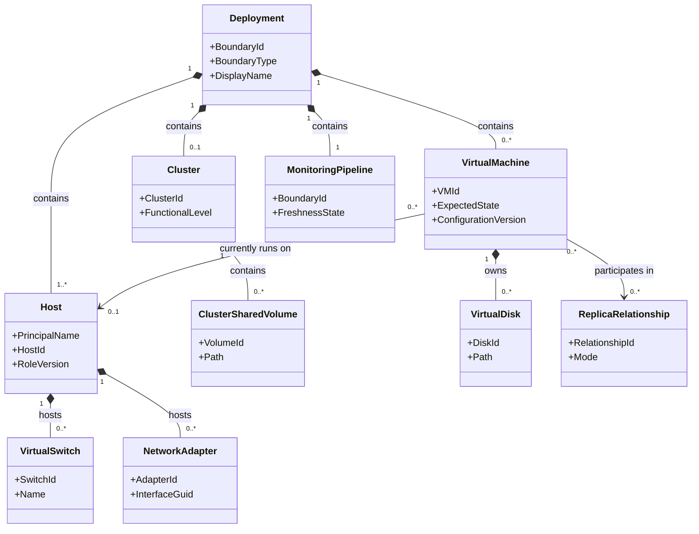
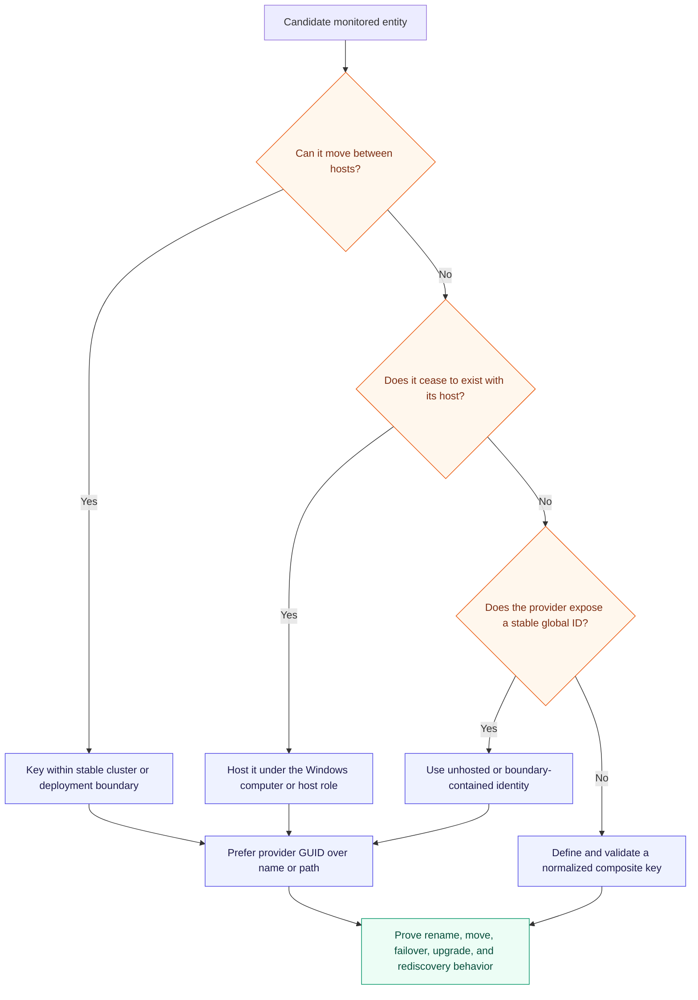
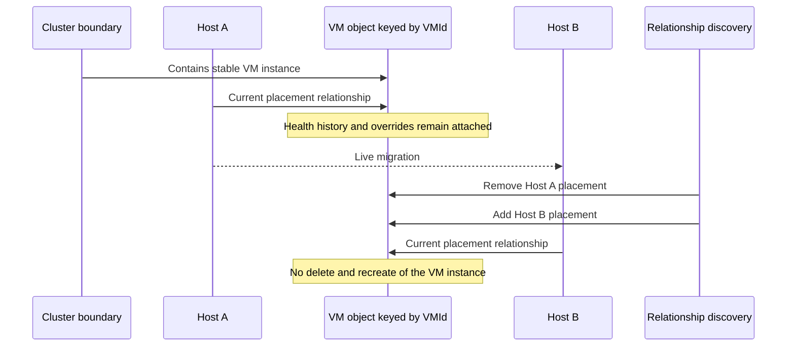
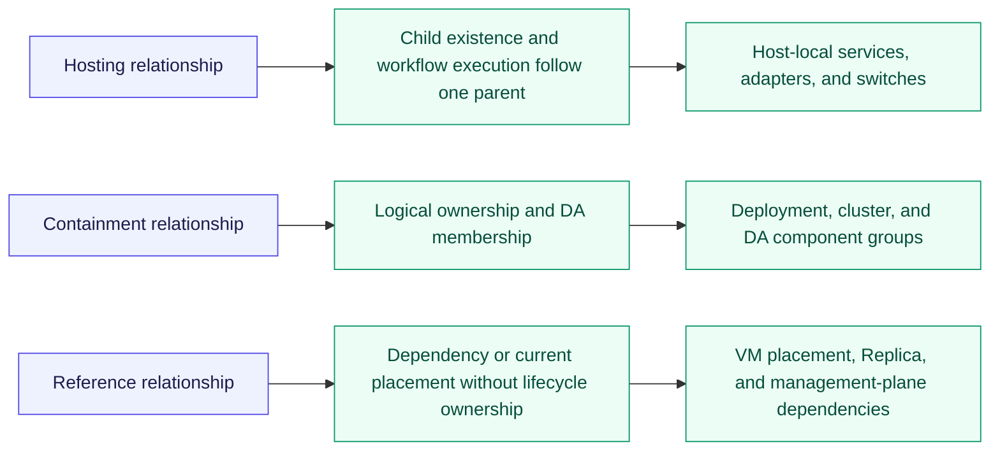
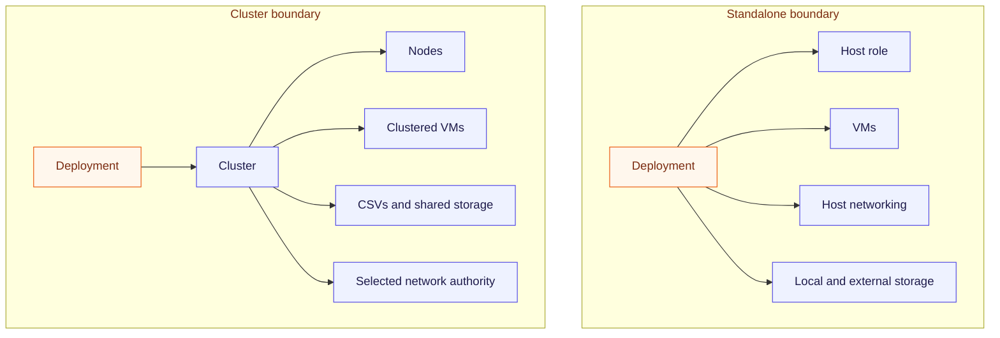

# Hyper-V class and relationship model

The object model must represent operational ownership without making transient placement part of an
object's identity. A VM can move between cluster nodes; its SCOM identity must survive that move.
A host adapter cannot move between computers; its identity can be hosted by the host. This distinction
drives class keys, hosting, relationship discovery, workflow placement, and upgrade safety.

ADR 0028 accepts the namespace and identity strategy. The functional development Library MP now
implements the first-release model; operator lab migration, scale, and upgrade tests follow
installation and feed version-increased corrections.

## Conceptual object model

This is a service model, not a promise to discover every possible child by default. High-cardinality
classes such as virtual disks and VM network adapters require an explicit catalog and scale decision.

## Class categories

| Category | Candidate classes | Identity and placement rule |
|---|---|---|
| Service boundary | Deployment, Cluster, Standalone Host Boundary | Stable cluster identity or host principal name; never a display name alone |
| Compute | Hyper-V Host Role, Cluster Node, VM | Host follows Windows computer; VM uses Hyper-V VM GUID and is contained by the stable boundary |
| Cluster | Cluster, Quorum, Clustered Role, Cluster Resource, Cluster Network | Prefer stable cluster identifiers and approved Microsoft cluster base types where supportable |
| Storage | CSV, volume, virtual disk, VHD/VHDX, storage path, Replica relationship | Keys use provider IDs or canonical paths with documented normalization |
| Network | Physical adapter, switch, port, VM adapter, Network ATC intent, SDN authority | Host-local components are hosted by host; authority objects are scoped to the boundary |
| Management | SCVMM management relationship, Network Controller dependency | Reference relationships only when the topology selects that authority |
| Monitoring | Boundary monitoring pipeline and discovery freshness | One platform-owned instance per DA boundary |

## Identity decision tree

## VM mobility contract

The VM is not hosted by a cluster node. Hosting it by a node would change its SCOM identity when it
moves and could orphan health history, alerts, relationships, and overrides.

## Relationship semantics

| Relationship | Use | Do not use for |
|---|---|---|
| Hosting | A child truly exists on one parent and workflows must execute there | Mobile VMs, cross-node cluster objects, or presentation-only grouping |
| Containment | A boundary or component group owns members for service modeling | Inferring where a workflow can execute |
| Reference | Current placement, Replica pairing, external authority, or another non-lifecycle dependency | Deleting a child when a source disappears |

## Candidate keys

| Entity | Preferred key | Fallback requiring proof | Never use alone |
|---|---|---|---|
| Failover cluster | Stable cluster/provider ID | Canonical cluster fully qualified domain name | Friendly display name |
| Standalone boundary | Windows computer principal name plus role identity | Machine GUID with rename migration plan | NetBIOS name only |
| VM | Hyper-V VM GUID | None unless Microsoft changes the provider contract | VM name or current host |
| CSV | Cluster-scoped volume unique ID | Normalized CSV path plus cluster key | Owner node or drive label |
| Virtual switch | Host key plus switch GUID | Host key plus invariant provider name | Display name without host |
| Physical adapter | Host key plus interface GUID | Host key plus permanent hardware identifier | Interface index alone |
| Replica | Source VM ID plus target relationship/provider ID | Normalized endpoint tuple | Friendly replication name |

## Class modeling rules

- Model only entities that need independent health, targeting, properties, relationships, views,
  overrides, or lifecycle. A property bag is preferable when a first-class object adds no value.
- Target workflows at the narrowest stable class that owns the signal.
- Keep class properties small, stable, operationally meaningful, and safe to store. Do not store
  rapidly changing measurements as properties.
- Every discovered class has a deterministic display name and every public property has a localized
  display string.
- Never use a mutable friendly name as the sole key.
- Avoid deep hosting chains; each level increases identity, discovery, and workflow complexity.
- Separate current placement from identity for every mobile or failover-capable object.
- Explicitly document whether disappearance means deletion, stale topology, monitoring failure, or
  temporary unavailability.

## Implemented class reference

The following table documents every class implemented in the Hyper-V Private Cloud Monitoring solution:

### Core Service and Distributed Application Classes

| Class ID | Base Class | Hosting Parent | Key Property | Role in Solution |
|---|---|---|---|---|
| `HyperVPrivateCloud.Service` | `SystemCenter!Microsoft.SystemCenter.ServiceDesigner.Service` | Unhosted (Root) | `BoundaryId` | Root of the Distributed Application representing a Failover Cluster or Standalone Host. |
| `HyperVPrivateCloud.ComputeComponent` | `SystemCenter!Microsoft.SystemCenter.ServiceDesigner.ServiceComponent` | Unhosted (DA Branch) | `Id` | Contains `HyperVPrivateCloud.HostRole` and physical server hardware objects. |
| `HyperVPrivateCloud.VirtualMachineComponent` | `SystemCenter!Microsoft.SystemCenter.ServiceDesigner.ServiceComponent` | Unhosted (DA Branch) | `Id` | Contains `HyperVPrivateCloud.VirtualMachine` instances with 25% rollup policy. |
| `HyperVPrivateCloud.StorageComponent` | `SystemCenter!Microsoft.SystemCenter.ServiceDesigner.ServiceComponent` | Unhosted (DA Branch) | `Id` | Contains CSVs, S2D pools, Pure Storage arrays, and SMB shares. |
| `HyperVPrivateCloud.NetworkComponent` | `SystemCenter!Microsoft.SystemCenter.ServiceDesigner.ServiceComponent` | Unhosted (DA Branch) | `Id` | Contains virtual switches, physical adapters, ToR ports, and firewalls. |
| `HyperVPrivateCloud.AvailabilityComponent` | `SystemCenter!Microsoft.SystemCenter.ServiceDesigner.ServiceComponent` | Unhosted (DA Branch) | `Id` | Contains cluster quorum, clustered roles, and heartbeat monitors. |
| `HyperVPrivateCloud.ManagementInfrastructureComponent` | `SystemCenter!Microsoft.SystemCenter.ServiceDesigner.ServiceComponent` | Unhosted (DA Branch) | `Id` | Contains AD domain services, DNS resolution services, and WDS deployment services. |
| `HyperVPrivateCloud.MonitoringPipelineComponent` | `SystemCenter!Microsoft.SystemCenter.ServiceDesigner.ServiceComponent` | Unhosted (DA Branch) | `Id` | Contains `HyperVPrivateCloud.MonitoringPipeline` self-monitoring instances. |

### Operational Managed Object Classes

| Class ID | Base Class | Hosting Parent | Key Property | Purpose |
|---|---|---|---|---|
| `HyperVPrivateCloud.HostRole` | `Windows!Microsoft.Windows.ComputerRole` | `Windows!Microsoft.Windows.Computer` | `PrincipalName` (inherited) | Represents the Hyper-V host role on a Windows Server node. |
| `HyperVPrivateCloud.VirtualMachine` | `System!System.LogicalEntity` | `HyperVPrivateCloud.HostRole` | `VirtualMachineId` (VM GUID) | Discovered per-VM object tracking configuration, heartbeat, integration services, and memory. |
| `HyperVPrivateCloud.ClusterSharedVolume` | `System!System.LogicalEntity` | `HyperVPrivateCloud.HostRole` | `VolumeId` | Discovered CSV volume representing shared cluster disk storage. |
| `HyperVPrivateCloud.ActiveDirectoryService` | `System!System.LogicalEntity` | Unhosted (DA Member) | `BoundaryId`, `DomainFqdn` | Tracks host AD secure channel, domain controller connectivity, and AD site. |
| `HyperVPrivateCloud.DnsService` | `System!System.LogicalEntity` | Unhosted (DA Member) | `BoundaryId`, `DnsServerAddresses` | Tracks adapter DNS resolver configuration and forward name resolution. |
| `HyperVPrivateCloud.DeploymentService` | `System!System.LogicalEntity` | Unhosted (DA Member) | `BoundaryId`, `ServerName` | Tracks Windows Deployment Services (WDSServer), TFTP, and PXE listeners. |
| `HyperVPrivateCloud.PhysicalChassis` | `System!System.LogicalEntity` | Unhosted (DA Member) | `BoundaryId`, `ChassisId` | Tracks physical server hardware, chassis, manufacturer, model, and serial number. |
| `HyperVPrivateCloud.TopOfRackSwitch` | `System!System.LogicalEntity` | Unhosted (DA Member) | `BoundaryId`, `SwitchId` | Tracks physical Top-of-Rack data switch uplinks, role, and chassis correlation. |
| `HyperVPrivateCloud.OutOfBandSwitch` | `System!System.LogicalEntity` | Unhosted (DA Member) | `BoundaryId`, `SwitchId` | Tracks physical Out-of-Band management network switch infrastructure. |
| `HyperVPrivateCloud.EdgeFirewall` | `System!System.LogicalEntity` | Unhosted (DA Member) | `BoundaryId`, `FirewallId` | Tracks perimeter firewall appliances, HA cluster role, and routing gateway health. |
| `HyperVPrivateCloud.ConsoleServer` | `System!System.LogicalEntity` | Unhosted (DA Member) | `BoundaryId`, `ApplianceId` | Tracks Opengear out-of-band console servers, cellular failover, and serial ports. |
| `HyperVPrivateCloud.DhcpService` | `System!System.LogicalEntity` | Unhosted (DA Member) | `BoundaryId`, `ServiceId` | Tracks DHCP and IPAM scope availability and pool exhaustion. |
| `HyperVPrivateCloud.MonitoringPipeline` | `Windows!Microsoft.Windows.LocalApplication` | `Windows!Microsoft.Windows.Computer` | `PipelineId` | Tracks PowerShell 7 engine health, discovery freshness, and probe execution. |

### Capability Classes & Adapters

| Capability | Target Class ID | Base Class | Hosting Parent | Integration Scope |
|---|---|---|---|---|
| **Cluster** | `HyperVPrivateCloud.Capability.Cluster.ClusterRole` | `Windows!Microsoft.Windows.ComputerRole` | `Cluster!Microsoft.Windows.Cluster.VirtualServer` | Executes once per cluster on the active core quorum node. |
| **Storage** | `HyperVPrivateCloud.Capability.Storage.StorageFabricRole` | `Windows!Microsoft.Windows.ComputerRole` | `HyperVPrivateCloud.HostRole` | Evaluates MPIO paths, iSCSI sessions, and Fibre Channel fabrics. |
| **S2D** | `HyperVPrivateCloud.Capability.S2D.S2DFabricRole` | `Windows!Microsoft.Windows.ComputerRole` | `HyperVPrivateCloud.HostRole` | Evaluates Storage Spaces Direct pools, virtual disks, and faults. |
| **Pure Storage** | `HyperVPrivateCloud.Capability.PureStorage.PureStorageArrayRole` | `System!System.LogicalEntity` | Unhosted | Correlates FlashArray hardware and volume health into the DA. |
| **File Services** | `HyperVPrivateCloud.Capability.FileServices.FileServicesRole` | `Windows!Microsoft.Windows.ComputerRole` | `HyperVPrivateCloud.HostRole` | Monitors SMB clients, shares, and SOFS storage endpoints. |
| **Physical Network** | `HyperVPrivateCloud.Capability.PhysicalNetwork.PhysicalNetworkRole` | `Windows!Microsoft.Windows.ComputerRole` | `HyperVPrivateCloud.HostRole` | Monitors physical adapters, link states, discards, and ToR switch port LLDP info. |
| **Network ATC** | `HyperVPrivateCloud.Capability.NetworkATC.NetworkATCRole` | `Windows!Microsoft.Windows.ComputerRole` | `HyperVPrivateCloud.HostRole` | Monitors Network ATC intent compliance, drift, and RDMA/QoS policies. |
| **SDN** | `HyperVPrivateCloud.Capability.SDN.SDNRole` | `Windows!Microsoft.Windows.ComputerRole` | `HyperVPrivateCloud.HostRole` | Monitors host-side Network Controller binding, certificates, and virtual networks. |
| **VMM** | `HyperVPrivateCloud.Capability.VMM.VMMRole` | `Windows!Microsoft.Windows.ComputerRole` | `HyperVPrivateCloud.HostRole` | Monitors SCVMM fabric connectivity, agent versions, and failed jobs. |
| **Opengear** | `HyperVPrivateCloud.Capability.Opengear.ConsoleServerRole` | `System!System.LogicalEntity` | Unhosted | Out-of-band serial console appliance, cellular failover, and rack sensors. |
| **Fortinet** | `HyperVPrivateCloud.Capability.Fortinet.FirewallRole` | `System!System.LogicalEntity` | Unhosted | FortiGate perimeter firewall, HA failover, and firewall-managed DHCP scopes. |
| **Dell OME** | `HyperVPrivateCloud.Capability.DellOME.HardwareChassisRole` | `System!System.LogicalEntity` | Unhosted | Dell OpenManage Enterprise physical server hardware, PSU, and thermal telemetry. |
| **Generic SNMP** | `HyperVPrivateCloud.Capability.Network.GenericSNMPRole` | `System!System.LogicalEntity` | Unhosted | Vendor-neutral SNMP v2c/v3 adapter for any ToR switch (Cisco, Arista) or firewall. |

## Boundary variants

## Release-validation gates

Before the first signed release, topology and lab research must prove:

1. the stable key for every supported entity;
2. the appropriate Microsoft base class and library dependency;
3. workflow execution location for hosted, unhosted, and cluster-owned objects;
4. deletion and rediscovery behavior during rename, live migration, failover, drain, and role removal;
5. scale/cardinality for optional child classes; and
6. whether SCVMM/SDN objects are modeled directly or represented as external dependencies.
