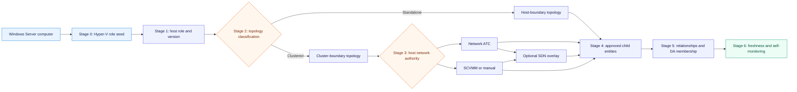
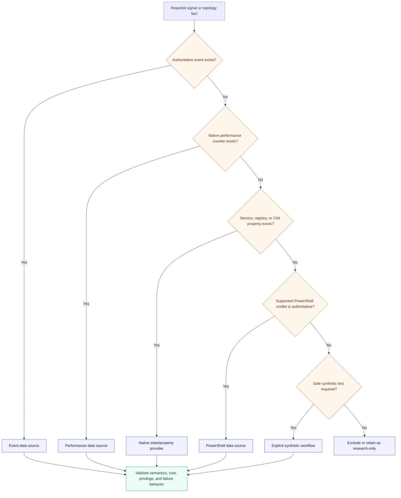
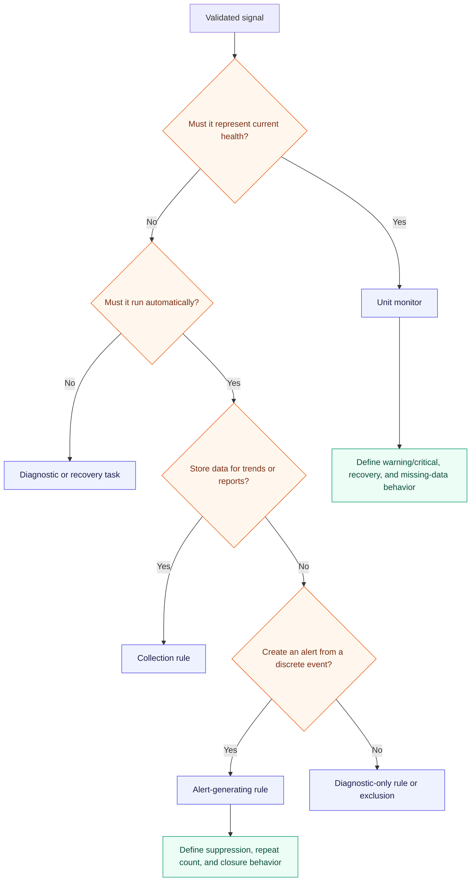
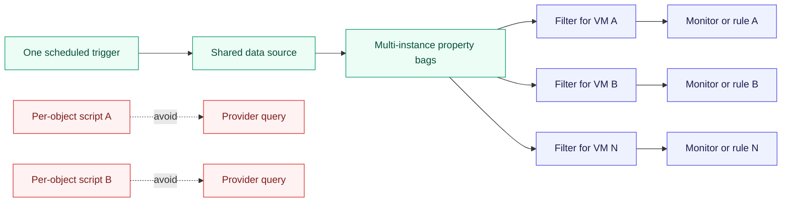
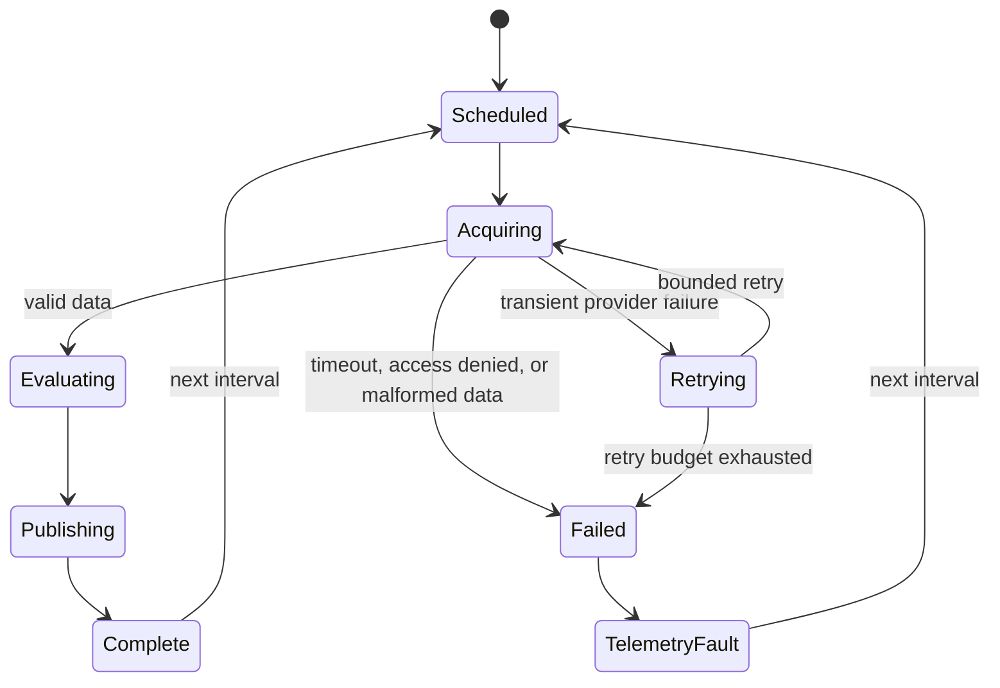
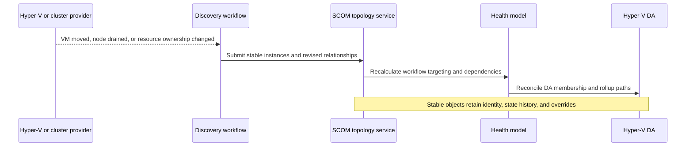

# Hyper-V discovery and workflow architecture

Discovery is staged from a cheap role seed to progressively richer topology. Monitoring begins only
after the target class exists, and each workflow runs where its target and data source can be
evaluated safely. The MP prefers native event, service, performance, registry, and CIM providers;
PowerShell is used where it supplies a materially better supported topology contract, not as a
universal wrapper around every signal.

## Staged discovery pipeline

Network authority is evaluated per layer. Network ATC may own host adapter and SET intent while
Network Controller owns the SDN overlay and VMM orchestrates the fabric. Discovery suppresses
duplicate identities and competing health paths, not valid layered coexistence.

Each stage has an independently testable contract. A failure in detailed storage discovery must not
erase the already proven Hyper-V host role or make the discovery pipeline appear healthy.

## Discovery contract

Every discovery defines:

| Field | Required content |
|---|---|
| Target | Narrowest stable seed class |
| Execution location | Agent, cluster-managing HealthService, or approved resource pool |
| Provider | Registry, service manager, event log, performance provider, CIM/WMI, PowerShell, or SDK |
| Key mapping | Source field to every class key and hosting key |
| Relationship mapping | Source, target, relationship type, and deletion behavior |
| Schedule | Interval, optional synchronization time, timeout, and jitter strategy if supported |
| Cost | Expected runtime, object count, data size, and provider calls |
| Failure behavior | Event/logging, stale deadline, retry, and last-known-topology policy |
| Security | Default action account or named Run As profile with minimum permissions |
| Test fixtures | Empty, normal, maximum scale, malformed data, access denied, timeout, and topology change |

## Source selection

## Monitor, rule, or task

Rules do not create durable current health. A condition that operators must see in Health Explorer
after the original event has passed needs a monitor with a reliable healthy transition or reset.

## Cookdown design

Cookdown is required where multiple workflows can use the same module configuration and provider
call. It is not assumed merely because scripts look similar: target, configuration XML, Run As,
schedule, and module parameters must be identical. Workflow research records expected cookdown groups and lab
evidence for each multi-instance data source.

## Workflow execution placement

| Signal owner | Preferred execution | Reason |
|---|---|---|
| Host-local service, event, counter, adapter, or switch | Agent on that host | Lowest latency and no remote credential path |
| VM runtime state | Agent currently responsible for the supported provider view | Avoid management-server fan-out; preserve VM identity separately from placement |
| Cluster-wide topology | Proven cluster-managing agent or approved resource pool | Requires one authoritative view and failover-safe execution |
| SCVMM/SDN management object | Approved management server/resource pool only if the variant is supported | Keep remote SDK access explicit and optional |
| DA membership reconciliation | Management server or resource-pool workflow with deterministic source relationships | Membership spans objects managed by multiple HealthServices |

## Workflow state machine

Retries must be bounded. Persistent failure becomes monitoring-pipeline health and actionable
knowledge rather than an infinite retry loop or a silent Healthy result.

## Topology-change sequence

## Authoring constraints

- Use reusable composite module types for repeated acquisition and state logic.
- Expose interval, timeout, enabled state, thresholds, consecutive samples, and recovery bands only
  when operators have a safe reason to override them.
- Never pass secrets in script arguments, events, property bags, alert parameters, or debug output.
- Emit one structured diagnostic event per failure episode, with throttling to prevent event storms.
- Return no discovery data only when the source authoritatively reports absence. Access denied,
  timeout, or malformed output is a workflow failure, not proof that objects disappeared.
- Keep collected properties deterministic; sort multi-instance results before building discovery
  data to make fixture comparison stable.
- All script data must be validated for type, range, null, duplicate key, and encoding behavior.

## Research gates

Workflow and lab research must validate source semantics, execution placement, cookdown, timeout,
cardinality, failure behavior, and recovery before the first signed release.
