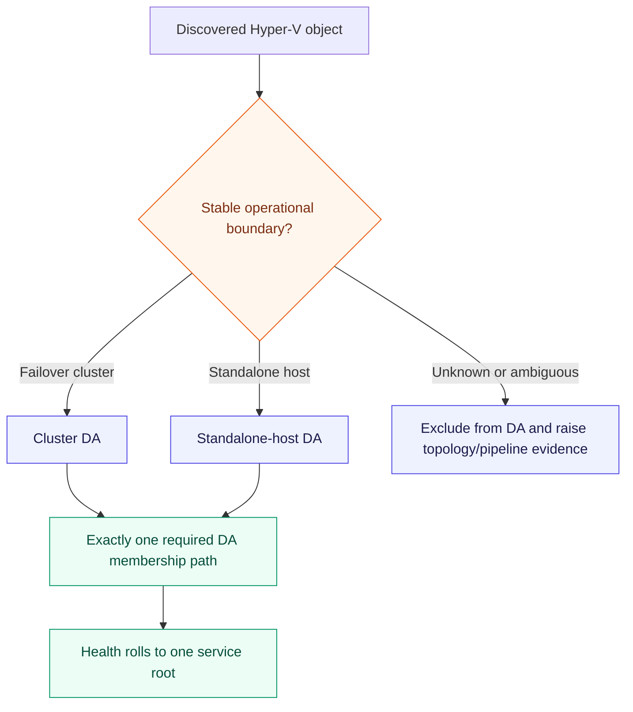
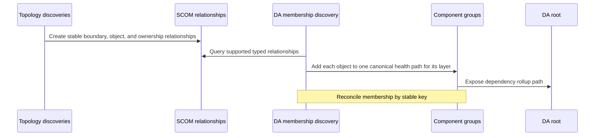
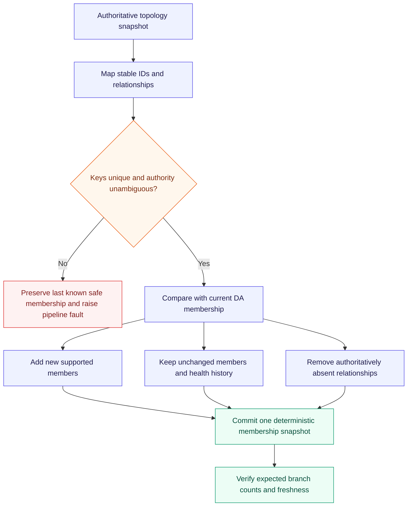
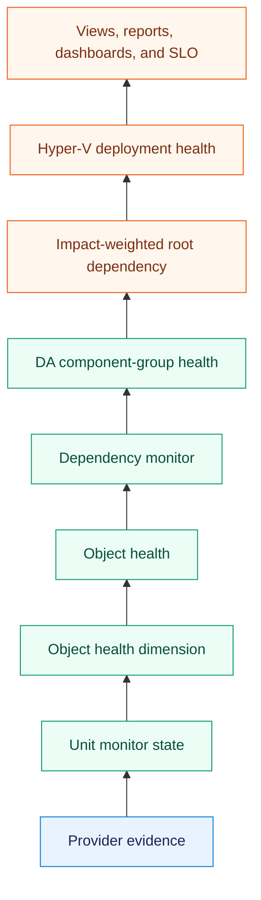
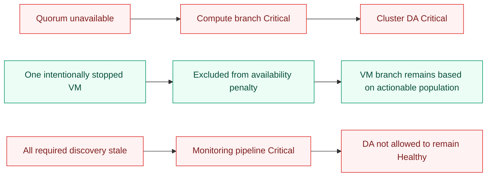
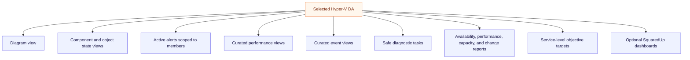

# Hyper-V Distributed Application design

The Hyper-V SCOM product ships a Hyper-V-owned Distributed Application (DA) with no dependency on
the Azure Local MP. One DA represents one operational failure boundary: a failover cluster or a
standalone Hyper-V host. The implemented root is `HyperVPrivateCloud.Service`, keyed by
the stable cluster-or-host boundary ID and derived from the SCOM Service Designer service class.

A DA organizes and presents health. It does not replace correctly targeted unit, aggregate, and
dependency monitors. Microsoft describes Distributed Applications as grouped monitored objects
whose overall health is calculated for service-oriented alerts, views, and reports. See
[Use the Authoring workspace in Operations Manager](https://learn.microsoft.com/en-us/system-center/scom/manage-using-authoring-workspace?view=sc-om-2025).

## Service boundary rule

SCVMM management does not merge unrelated clusters or hosts into one required DA. A future fleet
view can aggregate DAs through presentation content or a separately packaged integration MP.

## Comprehensive Private Cloud Distributed Application Architecture

The private cloud Distributed Application models the complete infrastructure fabric across seven core branches, including optional hardware and edge integrations:

```mermaid
graph TD
    Service["Hyper-V Private Cloud Service (DA Root)"]
    Service --> Compute["Compute Component"]
    Service --> VMs["Virtual Machines Component"]
    Service --> Storage["Storage Component"]
    Service --> Network["Network Component"]
    Service --> Avail["Availability & Clustering Component"]
    Service --> MgmtInfra["Management Infrastructure Component"]
    Service --> MonPipe["Monitoring Pipeline Component"]

    Compute --> HostRoles["Hyper-V Host Roles"]
    Compute -.-> DellOME["Dell OME Physical Server / Chassis (Optional Capability)"]

    MgmtInfra --> ADDS["Active Directory Domain & Secure Channel"]
    MgmtInfra --> DNS["DNS Services & Name Resolution"]
    MgmtInfra --> PXEWDS["PXE / WDS Bare-Metal Deployment"]
    MgmtInfra -.-> Opengear["Opengear OOB Console Servers (Optional Capability)"]

    Network --> VSwitches["Virtual Switches & SET Teams"]
    Network --> PhysAdapters["Host Physical Adapters"]
    PhysAdapters -.-> ToRPorts["ToR Switch Ports (LLDP/CDP Correlation)"]
    Network -.-> FortiGate["Fortinet Firewalls & DHCP Gateways (Optional Capability)"]

    Storage --> CSVs["Cluster Shared Volumes"]
    Storage -.-> S2DPools["Storage Spaces Direct Pools"]
    Storage -.-> PureArrays["Pure Storage FlashArrays"]
    Storage -.-> SMBShares["SOFS / SMB Storage Shares"]

    classDef root fill:#0078D4,color:#fff,stroke:none
    classDef core fill:#eef2ff,stroke:#4f46e5,color:#1e1b4b
    classDef leaf fill:#ecfdf5,stroke:#059669,color:#064e3b
    classDef opt fill:#fff7ed,stroke:#ea580c,color:#7c2d12,stroke-dasharray: 5 5
    class Service root
    class Compute,VMs,Storage,Network,Avail,MgmtInfra,MonPipe core
    class HostRoles,ADDS,DNS,PXEWDS,VSwitches,PhysAdapters,CSVs leaf
    class DellOME,ToRPorts,FortiGate,Opengear,S2DPools,PureArrays,SMBShares opt
```

## Component contract

| DA branch | Membership | Default root impact |
|---|---|---|
| Compute and host | Host role or cluster, nodes, clustered roles/resources, and optional Dell OME physical hardware health | Availability-critical; redundancy-aware for clustered hosts |
| Virtual machines | VMs classified as actionable by expected-state policy | Population-aware percentage rollup (25% threshold); individual maintenance VMs do not trigger false-positive outages |
| Storage and Replica | CSVs, approved storage paths, disks, VHD/VHDX dependencies, S2D, Pure Storage, and SMB shares | Availability or data-integrity critical where the dependency is required |
| Networking | Physical-to-virtual topology, virtual switches, SET uplinks, ToR switch ports (LLDP/CDP), and optional Fortinet firewalls/DHCP | Availability-critical for required paths; configuration drift can be lower impact |
| Availability and clustering | Windows Server Failover Cluster resources, quorum, networks, and CSV coordinator states | Availability-critical |
| Management infrastructure | Dedicated management domain services: Active Directory trust/channel, DNS resolution, PXE/WDS bare-metal deployment, and optional Opengear out-of-band console access | Availability-critical (cloud cannot authenticate or resolve resources without AD/DNS) |
| Monitoring pipeline | PowerShell 7 engine, agent telemetry, required discovery freshness, workflow health, and collection paths | Root-impacting so missing telemetry cannot look Healthy |

## Dynamic membership

The DA is authored in XML and populated from discovered classes and typed relationships. Operators
must not recreate it manually with the Distributed Application Designer.

Membership rules:

- Start from the stable DA boundary key, not an estate-wide group or name pattern.
- Traverse only product-owned or explicitly approved typed relationships.
- Give every required member exactly one canonical health path to avoid double weighting.
- Network ATC, SDN, VMM, and physical-network objects may coexist when they represent different
  layers; do not put the same object into competing canonical health paths.
- Retain intentionally non-impacting objects in state/inventory views when useful, without adding
  them to an availability dependency rollup.
- Treat empty required branches as topology or monitoring-pipeline faults, not Healthy success.

## Membership reconciliation

## Health propagation

Worst state is a starting point, not an unconditional algorithm. Redundant hosts, VM populations,
maintenance, node drain, planned migration, intentional power states, and monitoring freshness need
topology-aware policies validated through lab research.

## Failure examples

## Operator surfaces

Every surface scopes through stable DA membership or product-owned classes. Reports and dashboards
do not reimplement topology with display-name queries.

Microsoft permits service-level objectives to target a class, group, or Distributed Application.
The product provides DA-oriented guidance and validates the selected target in pre-production. See
[Service-level objectives](https://learn.microsoft.com/en-us/system-center/scom/manage-monitor-sla-overview?view=sc-om-2025).

## Required product artifacts

- Hyper-V-owned DA root and component-group class XML;
- deterministic dynamic membership discoveries for cluster and standalone boundaries;
- topology-aware aggregate and dependency monitors;
- localized diagram, state, alert, event, performance, and task views;
- availability and performance report/SLO guidance;
- optional SquaredUp Dashboard Server content targeting only Hyper-V classes; and
- import, empty-topology, population, move, failover, fault, recovery, scale, upgrade, coexistence,
  and removal tests.

## Release-validation gates

The DA is authored. Before release, lab evidence must prove:

1. stable cluster and standalone-host root keys;
2. deterministic membership and execution placement across HealthServices;
3. correct VM identity and membership during migration, drain, failover, rename, and removal;
4. layered Network ATC, manual/VMM, and SDN authority membership without duplicate object paths;
5. actionable expected-state and population rollups for VMs;
6. redundancy-aware host and cluster rollups;
7. Unknown/stale-data behavior and recovery;
8. acceptable membership and rollup cost at supported maximum scale; and
9. correct views, reports, dashboards, and SLO targeting.

## Related design

- [Hyper-V SCOM architecture](architecture.md)
- [Class and relationship model](class-and-relationship-model.md)
- [Health and alert architecture](health-and-alert-architecture.md)
- [ADR 0026 — Platform-owned SCOM Distributed Applications](../decisions/0026-platform-owned-scom-distributed-applications.md)
- [Hyper-V monitoring research](../../hyper-v/monitoring-research.md)
