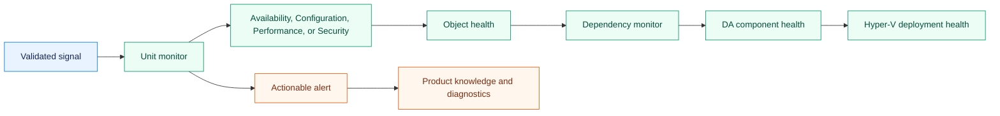
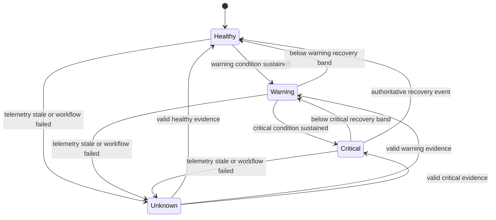
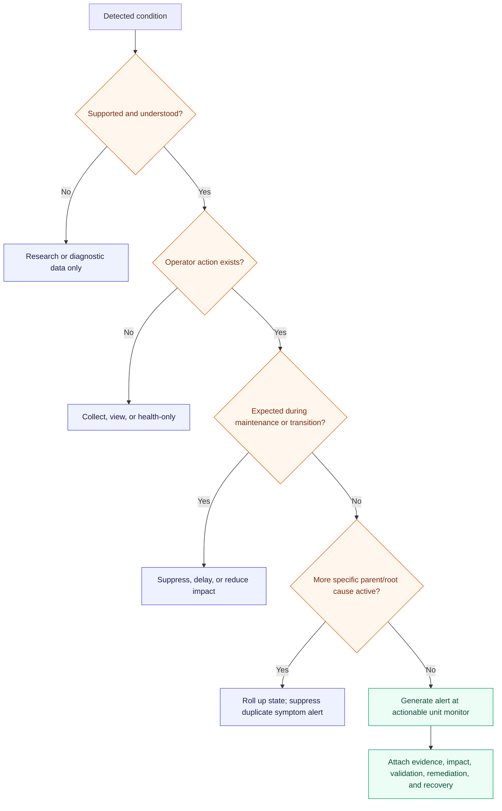
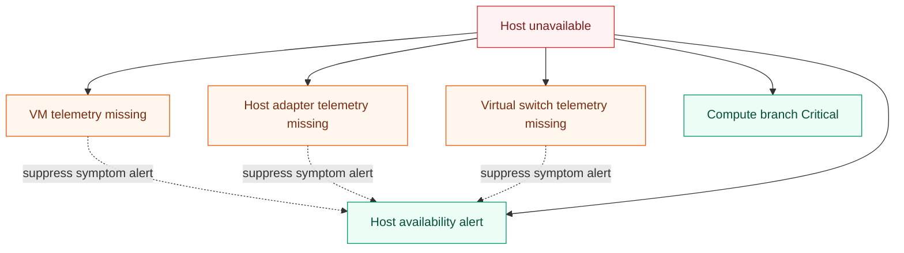
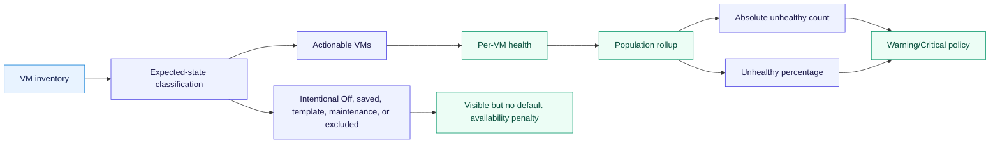
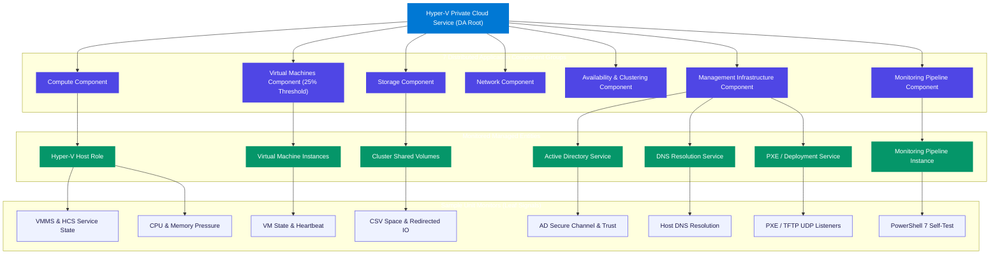

# Hyper-V health and alert architecture

Health answers **what is currently unhealthy**; alerts answer **what an operator should act on**.
They are related but not identical. Unit monitors establish object health, aggregate monitors organize
the four SCOM health dimensions, dependency monitors propagate service impact, and alerts originate
at the most actionable layer. Rules collect diagnostic history or alert on discrete events that do
not have a durable state model.

## Health construction

Aggregate and dependency monitors normally do not generate duplicate alerts. The leaf monitor that
has the evidence and remediation context alerts; its state then rolls up for service impact.

## Standard health dimensions

| Dimension | Hyper-V examples | Typical evidence |
|---|---|---|
| Availability | Host role, VM service, cluster/node/resource, CSV online, Replica availability | Service state, cluster state, authoritative events, heartbeat |
| Configuration | Version drift, unsupported topology, integration configuration, network authority drift | Registry, CIM, PowerShell, configuration provider |
| Performance | Sustained CPU pressure, memory pressure, latency, queue, packet loss | Performance counters and calculated property bags |
| Security | Explicit security posture signals that are both supported and actionable | Security/configuration provider; disabled unless evidence supports default health |

Security is not a catch-all for general configuration. The first release includes Security health
only for signals with a documented source, owner, remediation, and support boundary.

## Stateful threshold pattern

SCOM may render a missing or uninitialized state as unmonitored rather than a custom fourth state;
the implementation must map that platform behavior explicitly. It must not substitute Healthy for
missing evidence.

## Threshold contract

Every numeric monitor defines the complete time behavior, not only a percentage:

```mermaid
flowchart LR
    SAMPLE[Sample interval] --> WINDOW[Consecutive samples or duration]
    WINDOW --> ENTRY[Warning and critical entry bands]
    ENTRY --> HYST[Recovery bands and hysteresis]
    HYST --> STATE[Health transition]
    STATE --> ALERT[Alert severity, priority, and repeat behavior]
    ALERT --> ROLL[Object and DA impact]
    ROLL --> OVERRIDE[Safe override parameters]

    classDef contract fill:#eef2ff,stroke:#4f46e5,color:#1e1b4b
    classDef result fill:#ecfdf5,stroke:#059669,color:#064e3b
    class SAMPLE,WINDOW,ENTRY,HYST,OVERRIDE contract
    class STATE,ALERT,ROLL result
```

The default host-memory design does not alert at 75% utilization alone. It combines available or
reserved host memory, Hyper-V pressure, paging, sustained duration, topology, and lab evidence.
The same evidence contract applies to CPU, storage, network, and VM pressure.

## Alert decision flow

## Alert contract

Every enabled alert-generating workflow must define:

- source object and monitor/rule ID;
- condition, operational impact, and evidence captured in alert parameters;
- severity and priority with a consistent mapping;
- whether the alert auto-resolves, and the exact healthy/reset evidence;
- suppression key and repeat-count behavior for event storms;
- maintenance, migration, backup, checkpoint, drain, and failover behavior;
- probable causes, validation commands or views, remediation, escalation, and recovery verification;
- related performance, event, state, and task views; and
- DA branch and parent impact.

## Dependency and symptom suppression

Suppression must be implemented only where targeting and correlation are deterministic. When SCOM
cannot safely suppress a symptom, the MP should delay the child condition or provide correlation
knowledge instead of hiding a potentially independent fault.

## Population-aware VM health

An intentionally powered-off VM must not make the DA unhealthy by default. Expected state is an
explicit discovered or configured policy, not a guess based on one sample.

## Rollup defaults

| Scope | Proposed default | Reason |
|---|---|---|
| Unit monitor to dimension | Worst state within that dimension | Preserve the most severe supported condition |
| Dimension to object | Standard SCOM object health behavior | Keep Health Explorer predictable |
| Critical infrastructure child to branch | Worst state | One failed quorum, CSV, or required host dependency can be service-critical |
| Redundant host population | Topology-aware or percentage rollup | One drained node may not equal cluster outage |
| VM population | Expected-state plus absolute and percentage policy | Avoid one intentionally stopped VM poisoning a large service |
| Monitoring pipeline | Worst state with explicit freshness deadlines | Prevent false confidence when telemetry is absent |
| Branch to DA root | Impact-weighted dependency monitors | Availability-critical branches may affect root differently from advisory configuration |

## Monitoring coverage sets

| Coverage set | Intended behavior |
|---|---|
| Core | Low-noise availability, data-integrity, and monitoring-pipeline health enabled |
| Balanced | Core plus validated predictive performance and configuration monitoring |
| Deep diagnostic | High-cardinality collection and disabled-by-default monitors enabled selectively |

Coverage sets describe which validated workflows are selected. Lab, Standard, and Strict tuning
templates describe environment posture and the values applied to selected workflows. These are
orthogonal decisions, not separate sealed runtime products. Discovery changes remain in the
customer Discovery Overrides MP; monitor, rule, alert, and collection changes remain in the
customer Monitoring Overrides MP. See
[Override and tuning architecture](override-and-tuning-architecture.md).

## Detailed health rollup and dependency hierarchy

The Distributed Application aggregates thousands of underlying property-bag signals into a clean, hierarchical health model:

### Rollup policy specifics

1. **Virtual Machines Rollup (Anti-Noise Guard)**:
   - Rollup Monitor: `HyperVPrivateCloud.VirtualMachines.Members.Availability.Dependency.Monitor`
   - Algorithm: `Percentage`
   - Parameter: `25` (Requires >25% of VMs to be unhealthy before degrading the Virtual Machines component)
   - `MemberUnAvailable`: `Success` (An unmonitored or newly provisioned VM does not poison the health tree)
2. **Management Infrastructure Rollup**:
   - Rollup Monitors: `DomainHealth`, `DnsHealth`, `DeploymentService` roll directly into `ManagementInfrastructureComponent`.
   - Algorithm: `WorstOf` (Because Active Directory and DNS are critical prerequisites for cluster authentication and host operations).
3. **Compute and Host Rollup**:
   - Evaluates host services (`vmms`, `hcs`), hypervisor presence, host headroom, and reboot status.
   - Algorithm: `WorstOf` for core service availability; Warning for pending reboots.

## Implemented monitor catalog and override settings

The table below details core unit monitors, their health dimensions, default intervals, warning/error evaluation criteria, and overridable parameters:

| Monitor ID | Target Class | Dimension | Default Interval | Warning / Critical Condition | Overridable Parameters |
|---|---|---|---|---|---|
| `Host.VmmsService.Monitor` | `HostRole` | Availability | 60s | VMMS service stopped | `IntervalSeconds`, `TimeoutSeconds` |
| `Host.HostComputeService.Monitor` | `HostRole` | Availability | 60s | HCS service stopped | `IntervalSeconds`, `TimeoutSeconds` |
| `Host.Hypervisor.Monitor` | `HostRole` | Availability | 300s | Hypervisor present flag false | `IntervalSeconds`, `TimeoutSeconds` |
| `Host.CpuPressure.Monitor` | `HostRole` | Performance | 120s | CPU usage > 90% (Warning), > 95% (Critical) | `WarningThreshold`, `CriticalThreshold`, `SampleCount` |
| `Host.AvailableMemory.Monitor` | `HostRole` | Performance | 120s | Free RAM < 2048 MB (Warning), < 1024 MB (Critical) | `WarningThresholdMB`, `CriticalThresholdMB` |
| `Host.PendingReboot.Monitor` | `HostRole` | Configuration | 3600s | CBS or Windows Update reboot pending | `IntervalSeconds`, `TimeoutSeconds` |
| `Host.DomainHealth.Monitor` | `ActiveDirectoryService` | Availability | 900s | AD secure channel broken or PDC unreachable | `IntervalSeconds`, `TimeoutSeconds` |
| `Host.DnsHealth.Monitor` | `DnsService` | Configuration | 900s | Adapter DNS missing or forward resolution failing | `IntervalSeconds`, `TimeoutSeconds` |
| `Host.DeploymentService.Monitor` | `DeploymentService` | Availability | 900s | WDSServer stopped or TFTP/PXE ports closed | `IntervalSeconds`, `TimeoutSeconds` |
| `Host.PipelineFreshness.Monitor` | `MonitoringPipeline` | Availability | 300s | PowerShell 7 engine failure or telemetry drift | `IntervalSeconds`, `MaxDriftSeconds` |
| `Vm.State.Monitor` | `VirtualMachine` | Availability | 60s | VM not in expected operational state | `IntervalSeconds`, `TimeoutSeconds` |
| `Vm.Heartbeat.Monitor` | `VirtualMachine` | Availability | 60s | Integration services heartbeat missed | `IntervalSeconds`, `MissedThreshold` |
| `Vm.IntegrationServices.Monitor` | `VirtualMachine` | Configuration | 300s | Integration components outdated or degraded | `IntervalSeconds`, `TimeoutSeconds` |
| `Vm.MemoryPressure.Monitor` | `VirtualMachine` | Performance | 120s | VM memory demand > 95% of limit | `WarningThreshold`, `SampleCount` |
| `Vm.StorageLatency.Monitor` | `VirtualMachine` | Performance | 120s | Average virtual disk latency > 40ms | `LatencyThresholdMs`, `SampleCount` |
| `Vm.StorageQueue.Monitor` | `VirtualMachine` | Performance | 120s | Virtual disk queue depth > 32 | `QueueDepthThreshold`, `SampleCount` |
| `Cluster.Quorum.Monitor` | `ClusterRole` | Availability | 60s | Cluster quorum degraded or offline | `IntervalSeconds`, `TimeoutSeconds` |
| `Cluster.CSVState.Monitor` | `ClusterRole` | Availability | 60s | CSV volume offline or in redirected IO mode | `IntervalSeconds`, `TimeoutSeconds` |
| `Cluster.CSVFreeSpace.Monitor` | `ClusterRole` | Performance | 300s | Free space < 15% (Warning), < 5% (Critical) | `WarningPercent`, `CriticalPercent` |

## Operator tasks catalog

The management pack suite equips operators with read-only diagnostics and controlled remediations directly from the SCOM console:

| Task Name | Target Class | Type | What it does |
|---|---|---|---|
| `TestDomainHealth` | `ActiveDirectoryService` | Diagnostic | Validates domain trust, secure channel status, PDC emulator responsiveness, and AD site topology. |
| `TestDnsResolution` | `DnsService` | Diagnostic | Probes adapter DNS server configuration, forward name resolution, and domain controller SRV record lookups. |
| `TestPortConnectivity` | `HostRole` | Diagnostic | Performs TCP synthetic port checks against default gateways (HTTP/HTTPS/SMB) and Domain Controllers (LDAP/RPC/Kerberos/SMB/WinRM). |
| `TestPxeWdsHealth` | `DeploymentService` | Diagnostic | Verifies WDSServer service status, active UDP listeners on ports 67/68/69/4011, and the REMINST deployment share. |
| `GetLldpNeighbor` | `PhysicalNetworkRole` | Diagnostic | Probes physical host adapters and driver DCB properties to extract connected ToR switch port IDs and chassis IDs. |
| `PfcEtsCounters` | `PhysicalNetworkRole` | Diagnostic | Gathers real-time RDMA Activity, PFC pause frames, DCB traffic classes, and QoS priority policy drop counters. |
| `CollectDiagnosticSummary` | `HostRole` | Diagnostic | Generates a complete environmental summary of the host, Hyper-V services, and PowerShell 7 runtime health. |
| `RestartVmms` | `HostRole` | Remediation | Gracefully restarts the Virtual Machine Management Service (`vmms`). Requires operator confirmation. |
| `RestartHcs` | `HostRole` | Remediation | Gracefully restarts the Host Compute Service (`hcs`). Requires operator confirmation. |
| `MoveCsvCoordinator` | `ClusterRole` | Remediation | Rebalances or live-moves CSV ownership to an optimal cluster node. |
| `DrainNode` | `ClusterRole` | Remediation | Pauses and safely live-migrates all virtual machines away from the target host for maintenance. |
| `ResumeNode` | `ClusterRole` | Remediation | Resumes cluster scheduling on a maintenance-completed node. |
| `LiveMigrateVm` | `VirtualMachine` | Remediation | Initiates a live migration of the target VM to the best available host in the cluster. |

