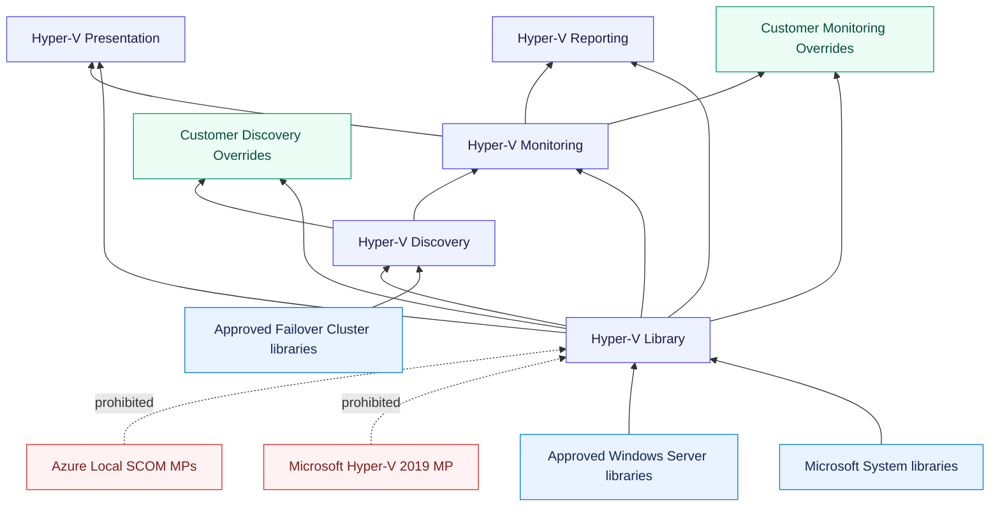
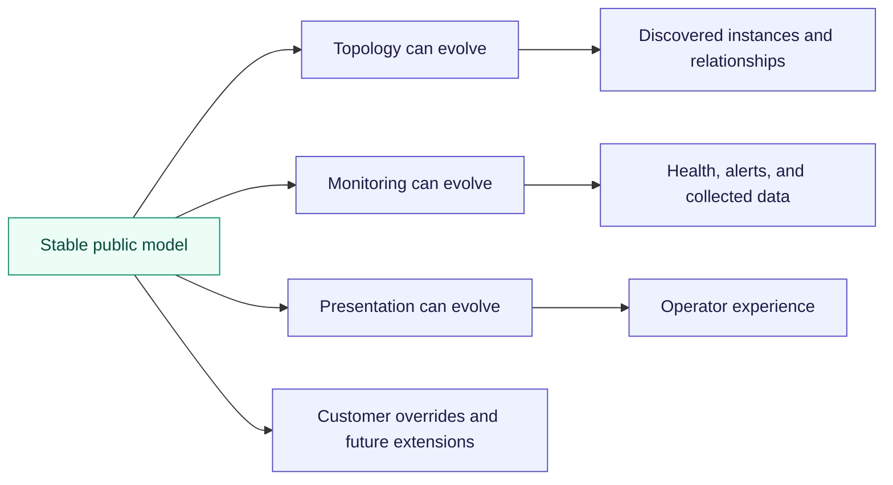
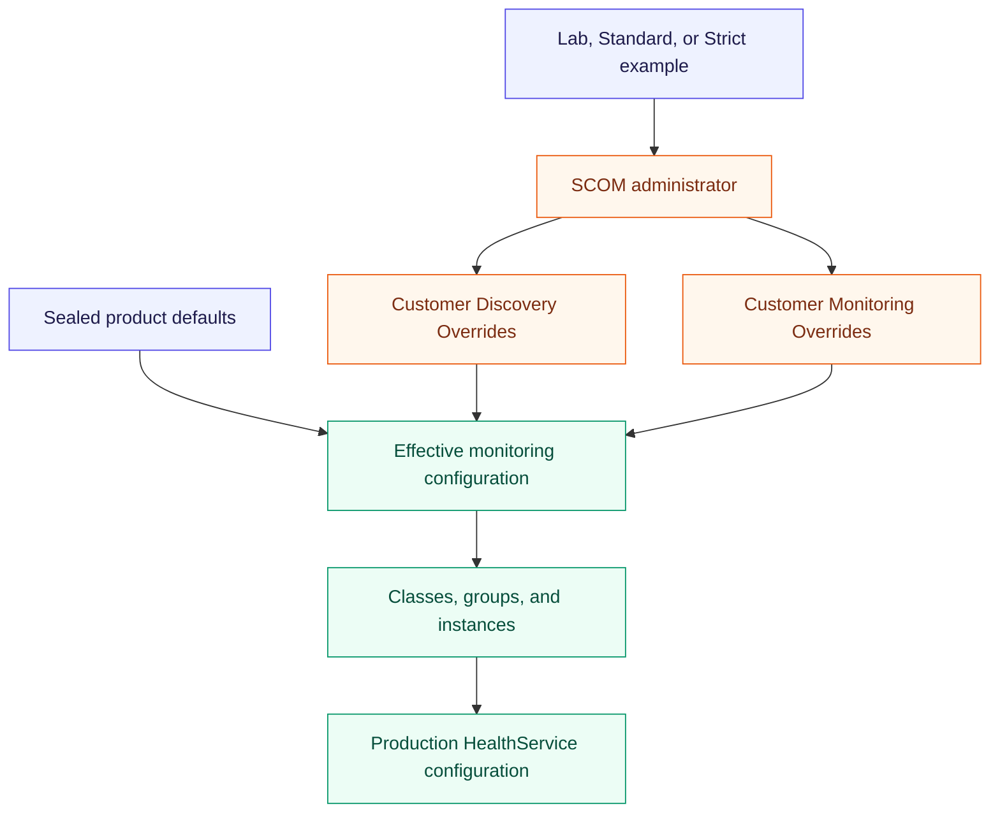

# Hyper-V Management Pack structure

The Hyper-V product is decomposed by responsibility so its model remains stable while monitoring,
presentation, and reporting evolve. Microsoft recommends logically grouping custom elements,
sealing reusable MPs that other MPs reference, and keeping overrides in separate writable MPs.
See [Select a Management Pack file](https://learn.microsoft.com/en-us/system-center/scom/select-management-pack-file?view=sc-om-2025)
and [Create a Management Pack for overrides](https://learn.microsoft.com/en-us/system-center/scom/manage-mp-create-unsealed-mp?view=sc-om-2025).

## Current v2 artifact set

Hyper-V Private Cloud Monitoring v2 uses the `HybridSolutionsCloud.HyperVPrivateCloud` namespace.
It ships four required sealed MPs—Library, Discovery, Monitoring, and Presentation—and nine optional
sealed capability adapters: Cluster, Storage, S2D, Pure Storage, File Services, Physical Network,
Network ATC, SDN, and VMM. This decomposition keeps the core importable without optional vendor or
Microsoft product MPs while allowing both SAN and S2D adapters in a hybrid deployment. Public
Discovery and Monitoring override MPs are generated separately for 11 deployment profiles and
three tuning tiers.

The exact v2 dependency and ownership graph is authoritative in the
[v2 dependency and ownership contract](v2-dependency-and-ownership-contract.md). The artifact table
below records the earlier `HybridSolutionsCloud.HyperV` baseline and is retained for compatibility
and design history; it is superseded for new v2 installations.

## Earlier baseline artifact set

`HybridSolutionsCloud.HyperV` is the earlier baseline namespace. Its source implements these IDs;
the current v2 product uses the namespace and decomposition documented above.

| Artifact | Form | Responsibility | Required dependencies |
|---|---|---|---|
| `HybridSolutionsCloud.HyperV.Library` | Sealed `.mp` | Classes, properties, relationships, reusable module types, secure references, icons, and core language strings | Approved Microsoft System and Windows libraries only |
| `HybridSolutionsCloud.HyperV.Discovery` | Sealed `.mp` | Seed, role, topology, relationship, DA, and membership discoveries | Hyper-V Library plus approved Windows/cluster libraries |
| `HybridSolutionsCloud.HyperV.Monitoring` | Sealed `.mp` | Unit and aggregate monitors, rules, diagnostics, recoveries, and tasks | Hyper-V Library and Discovery |
| `HybridSolutionsCloud.HyperV.Presentation` | Sealed `.mp` | Folder hierarchy, state, alert, performance, event, task, and diagram views | Hyper-V Library and Monitoring |
| `HybridSolutionsCloud.HyperV.Reporting` | Optional sealed `.mp` or `.mpb` resource | Reports and SLO-oriented presentation content | Hyper-V Library and applicable reporting libraries |
| Customer Discovery Overrides | Customer-owned unsealed `.xml` | Discovery enablement, schedules, timeouts, supported scope, and discovery-targeting groups | Hyper-V Library and Discovery |
| Customer Monitoring Overrides | Customer-owned unsealed `.xml` | Monitor/rule enablement, thresholds, timing, alerts, collection, and monitoring-targeting groups | Hyper-V Library and Monitoring |

The shipped release may combine tightly coupled sealed content into an `.mpb`, but the logical
boundaries and dependency direction remain unchanged.

## Dependency graph

No sealed Hyper-V artifact imports, extends, overrides, or requires the Microsoft Hyper-V 2019 MP
or any Azure Local MP. Referencing approved Microsoft System, Windows Server, and Failover Cluster
libraries is expected where those libraries supply stable platform base classes.

## Why the model is separated

The Library is the most expensive artifact to change because other sealed MPs and customer
override MPs can reference its element IDs. Model changes therefore require compatibility review;
monitoring and presentation changes can usually move faster.

## Override ownership

The product never writes to the Default Management Pack and never mutates a customer's override
MP. Discovery and Monitoring each have a corresponding customer-owned unsealed override MP.
Microsoft recommends one unsealed override MP for each sealed MP being customized, group targeting
instead of individual-instance overrides where practical, documentation of every override, and
validation in a test environment. See [Best practices for configuring overrides](https://learn.microsoft.com/en-us/troubleshoot/system-center/scom/best-practices-configure-overrides).

Optional Lab, Standard, and Strict templates are public examples only. Customers review, rename,
and copy selected settings into their own unsealed Discovery and Monitoring override MPs. Template
files are not signed product dependencies and are not imported automatically. The complete contract
is defined in [Override and tuning architecture](override-and-tuning-architecture.md).

## Release bundle

```mermaid
flowchart LR
    XML[Authored XML and resources] --> VERIFY[Schema and MP verification]
    VERIFY --> TEST[Test signing]
    TEST --> LAB[Pre-production import and fault tests]
    LAB --> RELEASE[Release signing]
    RELEASE --> BUNDLE[Versioned release bundle]
    BUNDLE --> GUIDE[Guide, catalog, changes, dependencies, and checksums]

    classDef source fill:#f5f3ff,stroke:#7c3aed,color:#3b0764
    classDef gate fill:#fff7ed,stroke:#ea580c,color:#7c2d12
    classDef output fill:#ecfdf5,stroke:#059669,color:#064e3b
    class XML source
    class VERIFY,TEST,LAB,RELEASE gate
    class BUNDLE,GUIDE output
```

Each release bundle must contain:

- sealed and release-signed MPs or MP bundles;
- a generator and separate Discovery and Monitoring starter-profile manifests for optional Lab,
  Standard, and Strict customer-owned overrides;
- the Management Pack guide, support matrix, monitoring catalog, and tuning guidance;
- release notes, dependency/version matrix, checksums, and license;
- import, upgrade, rollback, and removal instructions; and
- machine-readable inventory of artifact, element, and reference versions.

## Versioning rules

- Every shipped artifact in a release uses the same product version unless a documented exception
  is required by the packaging toolchain.
- Element IDs and class keys are immutable after public release unless a versioned migration design
  is accepted.
- Additive changes are preferred. Removing a class, property, relationship, monitor, or rule needs
  impact analysis for historical data, overrides, views, reports, and dependent customer MPs.
- A release never lowers a Management Pack version.
- The release signing identity is stable for the lifetime of the public product line.
- The dependency graph is generated and compared in continuous integration to prevent accidental
  Azure Local or legacy Hyper-V MP references.

## Packaging release gates

ADR 0027 resolves the logical artifact boundary. Each release must still record:

1. exact namespace and display-name prefix;
2. whether Reporting ships in the base bundle or as an optional add-on;
3. exact Microsoft library dependencies and minimum versions;
4. `.mp` versus `.mpb` packaging by artifact;
5. language-pack strategy; and
6. release and test signing identities.

For v2 `2.0.0.0`, these facts are resolved by ADRs 0039–0048 and the published
`release-manifest.json`; Reporting is not a v2 core artifact, the product is distributed as sealed
`.mp` files, and the permanent public key token is `54d0fb1159995c86`.
