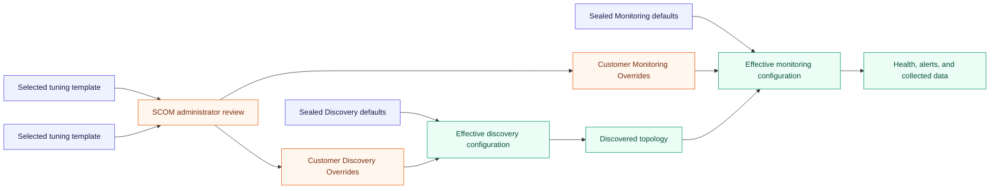
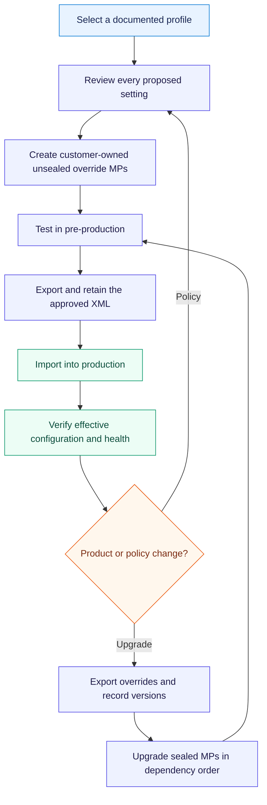

# Hyper-V override and tuning architecture

The Hyper-V product provides sealed defaults and stable overrideable parameters. It never edits its
sealed Management Packs after import and never stores customer changes in the Default Management
Pack. Customers own two unsealed override Management Packs so discovery policy and monitoring
policy can be serviced independently.

This page is a proposed design contract. Exact workflow IDs, parameter names, defaults, and safe
ranges remain evidence-gated until ADR 0027 and the monitoring catalog are accepted.

## Artifact boundary

| Artifact | Owner and form | Contains | Must not contain |
|---|---|---|---|
| Hyper-V Discovery | Product-owned sealed `.mp` | Discovery workflows, default schedules, and declared overrideable parameters | Environment-specific changes |
| Customer Discovery Overrides | Customer-owned unsealed `.xml` | Discovery enablement, schedules, timeouts, scope, and discovery-targeting groups | Monitor, rule, alert, or performance-collection overrides |
| Hyper-V Monitoring | Product-owned sealed `.mp` | Monitors, rules, tasks, defaults, and declared overrideable parameters | Environment-specific changes |
| Customer Monitoring Overrides | Customer-owned unsealed `.xml` | Monitor/rule enablement, thresholds, timing, alerts, collection, and monitoring-targeting groups | Discovery overrides |
| Lab, Standard, and Strict templates | Product-maintained public examples, not imported product dependencies | Reviewed starter values and a manifest of the settings they change | Customer names, credentials, destinations, or undisclosed active policy |

Recommended customer-owned Management Pack IDs are:

- `<Organization>.HybridSolutionsCloud.HyperV.Discovery.Overrides`; and
- `<Organization>.HybridSolutionsCloud.HyperV.Monitoring.Overrides`.

The organization prefix makes ownership clear and prevents a customer file from appearing to be a
signed product artifact. The display name can use the organization's normal naming convention.

Microsoft recommends one unsealed override Management Pack for each sealed Management Pack being
customized. This avoids coupling unrelated customizations during upgrade or removal. See
[Create a Management Pack for overrides](https://learn.microsoft.com/en-us/system-center/scom/manage-mp-create-unsealed-mp?view=sc-om-2025).

## Effective configuration flow

The templates do not bypass administrator review. Applying a template means creating or updating
customer-owned overrides after confirming topology, support, capacity, and operational intent.

## Discovery override contract

Discovery settings are intentionally isolated because they affect object existence, relationship
membership, workflow cardinality, and Distributed Application population.

| Parameter family | Intended use | Required guardrail |
|---|---|---|
| `Enabled` | Include or exclude an optional supported discovery | Required dependencies and seed discoveries cannot be disabled without a documented impact warning |
| `IntervalSeconds` | Change discovery frequency | Published minimum and maximum; timeout remains lower than interval |
| `SyncTime` | Stagger compatible discoveries | Optional and consistently formatted when the module supports it |
| `TimeoutSeconds` | Bound provider or script execution | Less than the schedule interval and tested under degraded providers |
| Scope or depth | Limit expensive optional topology | Exposed only where the result remains complete and semantically valid |

Disabling a discovery does not necessarily remove objects that were already discovered. Removal of
disabled class instances is a separate, potentially destructive administrative operation and must
follow Microsoft's documented process only after the target and downstream impact are verified.
See [Apply overrides to object discoveries](https://learn.microsoft.com/en-us/system-center/scom/manage-apply-overrides-object-discovery?view=sc-om-2025).

## Monitoring override contract

Monitoring settings control evaluation and collection without changing the class model.

| Parameter family | Applies to | Required documentation |
|---|---|---|
| `Enabled` | Monitors and rules | Default, reason, scope, and effect on health or data collection |
| Warning and critical thresholds | Performance and state evaluation | Unit, comparison direction, range, duration, and evidence source |
| Consecutive samples or duration | Stateful monitors | Sampling relationship, state-transition delay, and failure/recovery behavior |
| Recovery threshold or hysteresis | Stateful monitors | Recovery semantics and protection against state flapping |
| Interval, synchronization, and timeout | Monitors and collection rules | Units, safe bounds, expected cost, and cookdown implications |
| Alert generation, severity, and priority | Alert-producing workflows | Health behavior, alert behavior, routing impact, and auto-resolution behavior |
| Collection enablement and frequency | Performance and event rules | Database-volume impact, retention assumptions, and reporting dependencies |

Internal script text, commands, provider paths, credentials, secure references, object keys, and
module semantics are not exposed as overrides. An operator may tune policy, but cannot use an
override to change the workflow into an unsupported program.

## Targeting policy

Use the narrowest maintainable policy target, not the narrowest possible object.

1. Use a class override only when the policy applies to every supported instance of that class.
2. Prefer a group override for tiers, sites, hardware families, clusters, or workload classes.
3. Use a specific-instance override only for a documented exception with an owner and review date.
4. Validate the effective configuration when multiple overrides can apply.

Operations Manager applies class, group, and instance overrides at different levels of specificity.
The product guide follows Microsoft's recommendation to prefer groups over individual objects for
manageable policy. See [Override a rule or monitor](https://learn.microsoft.com/en-us/system-center/scom/manage-mp-override-rule-monitor?view=sc-om-2025)
and [Best practices for configuring overrides](https://learn.microsoft.com/en-us/troubleshoot/system-center/scom/best-practices-configure-overrides).

An unsealed Management Pack cannot reference a group in another unsealed Management Pack. A group
used for Discovery overrides therefore belongs in the customer Discovery Overrides MP; a group used
for Monitoring overrides belongs in the customer Monitoring Overrides MP. A future shared group
library would have to be sealed and is not part of the initial product design.

## Optional tuning templates

| Template | Intended environment | Design posture |
|---|---|---|
| Lab | Short-lived validation and fault testing | Faster supported discovery/evaluation and optional diagnostics where lab scale and data volume permit; never presented as a production baseline |
| Standard | Typical production starting point | Evidence-backed product defaults with only documented, broadly applicable adjustments |
| Strict | Explicitly designated critical services | More sensitive or frequent policy only where evidence, response capacity, and noise testing justify it |

Each profile is delivered as public documentation, a machine-readable setting manifest, generated
examples, and optional first-party unsealed profile MPs. Customer mode assigns organization-owned
IDs and display names. Public-profile mode assigns product-owned profile IDs so the reviewed packs
can be distributed with a release. Import only one profile for a product and environment; later
adjustments belong in customer-owned overrides.

### Profile schema

Schema `1.2` makes every monitoring target explicit. Each target declares its complete `monitorId`
and `contextClassId`; the generator does not construct either value from naming conventions.
Discovery settings likewise declare their workflow, context class, and module. The generator
rejects unknown schema versions before producing output.

The generated override MP has two independent version facts:

- `Version` is the customer- or profile-owned unsealed MP identity and defaults to `1.0.0.0`.
- `ProductVersion` is mandatory and must equal the installed sealed product version used in every
  product reference.

Changing the override MP version must never change its sealed product references. Release and CI
tests generate different values for these fields and assert that each is written only to its
intended XML elements.

The templates are versioned with the product release that defined their workflow IDs. A release
must publish a profile change log and identify added, changed, retired, and no-longer-effective
settings. Templates never contain credentials, notification endpoints, Run As assignments, or
company-specific groups.

## Lifecycle rules

- Never store an override, group, custom monitor, rule, view, or company knowledge in the Default
  Management Pack.
- Never edit a sealed product MP or rebuild it with customer changes.
- Export approved unsealed override MPs after every change and retain them in the customer's own
  controlled configuration repository.
- Test both override MPs during product upgrade, but do not merge them merely to reduce file count.
- Remove references in dependency order and test removal only in an isolated management group.
- Treat discovery disablement and object cleanup as separate changes with separate validation.

## Required release evidence

Before ADR 0027 can be accepted, validation must prove:

- every public override parameter has stable naming, units, defaults, safe ranges, and knowledge;
- the Discovery and Monitoring override MPs import, export, upgrade, and remove independently;
- Lab, Standard, and Strict manifests reference only elements in the matching product version;
- group and instance overrides produce the expected effective configuration;
- an upgrade preserves representative customer overrides and reports obsolete settings; and
- no test or product workflow writes to the Default Management Pack.

The public [Management Pack administration guide](../../hyper-v/management-pack-guide.md) turns
this architecture into an operator procedure.
