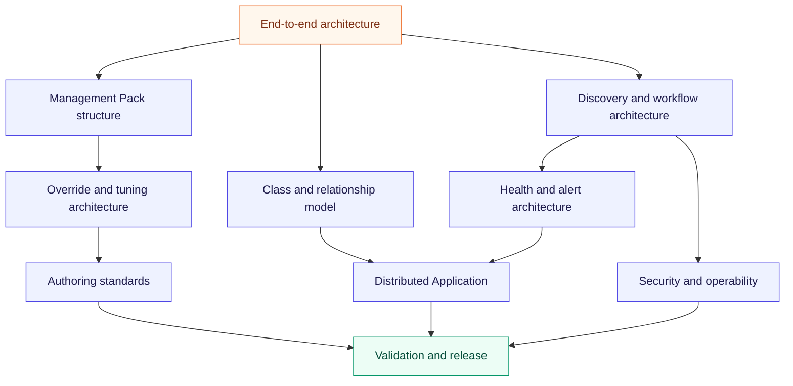

# Hyper-V SCOM Management Pack design

This is the active first delivery lane. Hyper-V Private Cloud Monitoring `1.2.0.0` and its
governed release assets are published in this repository under public key token `54d0fb1159995c86`.
Its design contracts are authoritative for Hyper-V.

## Design map

| Design contract | Purpose |
|---|---|
| [End-to-end architecture](architecture.md) | Requirements, topology variants, runtime planes, data flow, and non-functional requirements |
| [Management Pack structure](management-pack-structure.md) | Proposed sealed artifacts, dependencies, override boundary, and release bundle |
| [Override and tuning architecture](override-and-tuning-architecture.md) | Separate customer Discovery/Monitoring overrides, public profile templates, parameters, targeting, and lifecycle |
| [Class and relationship model](class-and-relationship-model.md) | Stable identity, hosting, containment, reference relationships, and VM mobility |
| [Discovery and workflow architecture](discovery-and-workflow-architecture.md) | Staged discovery, source selection, execution placement, cookdown, monitors, rules, and tasks |
| [Health and alert architecture](health-and-alert-architecture.md) | Health dimensions, thresholds, state, alerting, suppression, expected state, and rollup |
| [Distributed Application](distributed-application.md) | Cluster/standalone service roots, dynamic membership, branches, rollup, and operator surfaces |
| [Authoring standards](authoring-standards.md) | IDs, display strings, knowledge, overrides, modules, scripts, and definition of done |
| [Security and operability](security-and-operability.md) | Least privilege, Run As, task safety, monitoring-pipeline health, and diagnostics |
| [Validation and release](validation-and-release.md) | Static, fixture, lab, fault, scale, lifecycle, signing, and publishing gates |
| [Governed release runbook](release-runbook.md) | Permanent signing, repository-hosted assets, checksums, publication, and post-install validation |

## Architecture decisions

| ADR | Decision | Status and gate |
|---|---|---|
| [0027](../decisions/0027-hyper-v-scom-management-pack-decomposition.md) | Modular sealed artifacts, separate customer Discovery/Monitoring overrides, and optional tuning templates | Accepted; baseline evolved by the v2 capability decomposition |
| [0028](../decisions/0028-hyper-v-object-and-discovery-architecture.md) | Stable boundary identity, mobile VM model, staged discovery, execution placement, and cookdown | Accepted; implemented, post-install lifecycle validation pending |
| [0029](../decisions/0029-hyper-v-health-alert-and-da-rollup.md) | Evidence-driven health, actionable alerts, topology-aware rollup, and monitoring-pipeline branch | Accepted; starter defaults remain lab-tunable |
| [0031](../decisions/0031-hyper-v-mp-authoring-toolchain.md) | Tool-neutral XML/fragments, PowerShell build checks, Microsoft verification/sealing, and lab authority | Accepted and amended by ADR 0048; permanent sealing published, post-install lab evidence pending |

These refine accepted ADRs [0022](../decisions/0022-scom-management-pack-packaging-boundaries.md),
[0025](../decisions/0025-hyper-v-network-management-authority.md), and
[0026](../decisions/0026-platform-owned-scom-distributed-applications.md). They do not change the
independent product boundary.

## Current design baseline

| Concern | Current authority |
|---|---|
| Support matrix and topology | Support and topology research |
| Raw Windows Server, Hyper-V, cluster, storage, and network inventories | Signal inventory research |
| Prior Microsoft MP research | Reference analysis only; no dependency |
| SCOM workflow mapping | Workflow research |
| Threshold and tuning policy | Threshold engineering |
| Lab and fault validation | Lab evidence |
| Curated default catalog | Catalog synthesis |
| DA classes and membership | DA design validation |
| DA rollups and operator surfaces | DA behavior validation |
| Architecture validation and ADR resolution | Architecture evidence review |

## Authoring boundary

The Microsoft Hyper-V 2019 MP is research evidence only. The new product does not import, extend,
override, require, or take a runtime dependency on it. The same prohibition applies to Azure Local
MPs. Approved Microsoft System, Windows Server, and Failover Cluster libraries can be referenced
when the support and compatibility matrix explicitly identifies them.

The design follows current Microsoft guidance for MP contents, separate overrides, Run As
assignment, pre-production lifecycle validation, Distributed Applications, and service-level
objectives. Detailed legacy authoring concepts remain useful only when revalidated against the
supported SCOM releases.

## Research and implementation pages

- [Phase-one research plan](../../hyper-v/monitoring-research.md)
- [Monitoring catalog and threshold policy](../../hyper-v/monitoring-catalog.md)
- [Hyper-V SCOM product page](../../hyper-v/scom-mp.md)
- [Management Pack administration guide](../../hyper-v/management-pack-guide.md)
