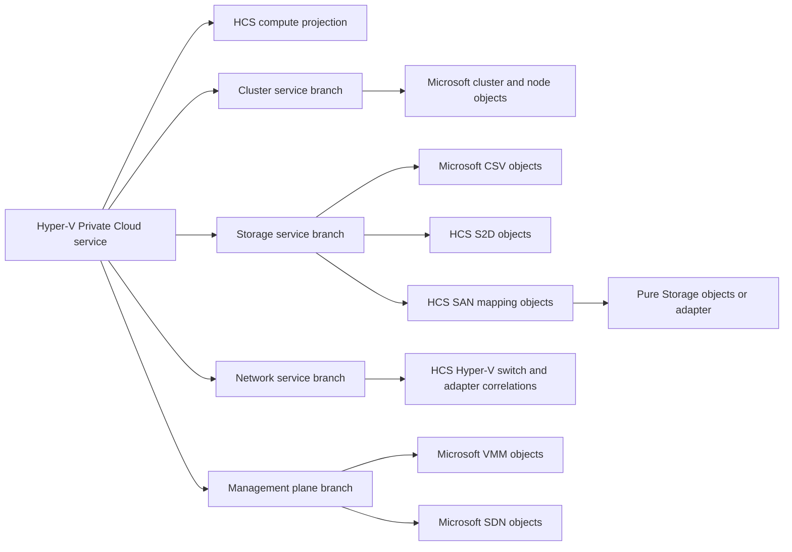

# Hyper-V Private Cloud v2 dependency and ownership contract

## Decision summary

Hyper-V Private Cloud Monitoring v2 reuses stable, public objects from supported sealed Microsoft
and vendor Management Packs when those packs already own the resource. HCS owns the private-cloud
service projection, missing domain objects, cross-domain correlations, and service-impact
relationships. It does not create a second cluster, cluster node, cluster network, cluster resource,
or Cluster Shared Volume identity merely to place that object in an HCS view.

The console product name is **Hyper-V Private Cloud Monitoring** and its monitoring root is
**Hyper-V Private Cloud**. Internal IDs use the new `HybridSolutionsCloud.HyperVPrivateCloud`
namespace. The public `HybridSolutionsCloud.HyperV` preview remains a separate compatibility
surface; v2 does not rename or repurpose its released element IDs.

## Verified Microsoft contracts

The following inventory was produced from the sealed, Microsoft-published packages, not inferred
from display names or documentation screenshots.

| Package inspected | Published version | Public contract relevant to v2 |
|---|---:|---|
| Operations Manager built-in Windows Cluster Library | `7.0.8447.6` in the OM2022 authoring reference set | `Microsoft.Windows.Cluster`, `Microsoft.Windows.Cluster.Service`, and `Microsoft.Windows.Cluster.VirtualServer`; no public CSV class |
| Windows Server Cluster 2016 and above | `10.1.0.0` | Public cluster component, node, node role, group, hosted group, network, resource, monitoring-service, and containment/hosting relationships |
| Windows Server Operating System 2016 and above | `10.1.2.2` | Public Windows Server computer, operating-system, disk, adapter, processor, and group model |
| Windows Server Cluster Shared Volume Monitoring | `10.1.2.2` | Public CSV and cluster-disk classes, CSV discovery, free-space monitors, performance collection, and dashboards |

Microsoft's current SCOM guidance also says that the Windows Server Operating System Management
Pack provides CSV discovery and monitoring. That makes an HCS-owned parallel CSV identity an
integration defect for v2, not added coverage.

The inspected CSV MP exposes `Microsoft.Windows.Server.ClusterSharedVolumeMonitoring.`
`ClusterSharedVolume` with `ClusterSharedVolumeName` as its key and discovers it beneath the
Microsoft cluster virtual-server identity. The inspected Cluster MP exposes public containment from
`Microsoft.Windows.Cluster` to node, group, and network and hosting from hosted groups to cluster
resources. These are suitable endpoints for HCS-owned reference and service-membership
relationships.

## Required and optional dependency boundary

| HCS v2 capability pack | External dependency | Policy |
|---|---|---|
| Core library, compute, and base presentation | Operations Manager built-in System, Windows, System Center, Health, Performance, and Service Designer libraries | Required; retain the lowest verified reference versions that contain the used types |
| Failover Cluster Integration | Microsoft Windows Server Cluster 2016 and above MPs, minimum package `10.1.0.0` | Optional for standalone; mandatory before importing the HCS cluster capability |
| CSV Integration | Microsoft Windows Server Operating System 2016 and above including `Microsoft.Windows.Server.ClusterSharedVolumeMonitoring`, minimum package `10.1.2.2` | Optional for standalone; mandatory before importing the HCS CSV/service-impact adapter |
| S2D | Windows Server cluster and CSV contracts plus Windows storage and cluster Health Service APIs | HCS owns the S2D objects absent from the inspected Microsoft MP model; it correlates volumes to Microsoft CSV objects |
| SAN Core | Windows Server storage, MPIO, iSCSI, Fibre Channel, SMB, and cluster contracts | HCS owns common path/LUN/mapping projections only where no supported sealed MP owns them |
| Pure Storage Integration | A currently supported Pure Storage sealed MP, if its public model and target-version support pass the vendor spike; otherwise a documented read-only Purity REST 2.x adapter | Never a core dependency; credentials use Run As, and the adapter is independently installable/removable |
| VMM Integration | Matching Microsoft VMM Management Packs for the supported VMM/SCOM version pair | Never a core dependency; reference VMM clouds, host groups, logical networks, logical switches, storage, and jobs instead of rediscovering them |
| SDN Integration | Matching Microsoft SDN/Network Controller contracts where public and supported | Never a core dependency; no inferred authority merely because a class exists |

An optional capability's presentation and Distributed Application population are packaged with or
behind that capability. The base presentation MP must not take every optional dependency and turn a
standalone installation into an all-or-nothing import.

## Object ownership rules

1. A supported sealed Microsoft or vendor class remains the authoritative identity when it
   represents the same real resource and exposes stable public keys.
2. HCS may define a relationship whose endpoint is an external public class. That is the normal
   mechanism for traversal into the private-cloud DA, diagram, state, alert, and performance views.
3. HCS defines a new class only for a missing concept, an HCS-owned service projection, or a
   materially different lifecycle/identity that cannot safely specialize the external class.
4. Discovery never submits a competing external object with guessed keys. Correlation must use the
   documented external keys and be proven in standalone, failover, rename, migration, and removal
   tests.
5. External leaf monitors remain the leaf alert authority. HCS dependency monitors roll their
   health into service impact without creating duplicate symptom alerts.
6. Optional dependencies are isolated in adapter MPs. Core compute remains importable and useful
   without Cluster, CSV, Pure, VMM, or SDN packs.

## v2 service graph

S2D and SAN branches are independent and may both populate the same private-cloud service. No
capability-detection path is allowed to disable the other.

## Preview migration boundary

The `0.1` preview is not upgraded by renaming its public elements. The v2 installer and guide must:

- detect the preview before import;
- prevent both products from actively monitoring the same workflows by default;
- preserve preview history for the documented retention/migration window;
- provide explicit disable/remove steps and dependency ordering; and
- state that preview overrides cannot be assumed compatible with the v2 namespace.

## Remaining contract spikes

The following dependencies are not approved until their exact public contracts are inspected and
recorded in this page:

- Microsoft VMM MPs for each supported SCOM/VMM pair;
- Microsoft SDN and Network Controller MPs;
- the current Pure Storage FlashArray SCOM MP, including support status and public class keys;
- File and iSCSI Services/SOFS objects used for Hyper-V over SMB; and
- physical network-device classes used for switch-to-NIC correlation.

## Sources

- [Microsoft Management Packs](https://learn.microsoft.com/en-us/system-center/scom/management-pack-list?view=sc-om-2025)
- [Monitoring Failover Cluster with Operations Manager](https://learn.microsoft.com/en-us/system-center/scom/manage-monitor-clusters-overview?view=sc-om-2025)
- [Windows Server Cluster 2016 and above MP 10.1.0.0](https://www.microsoft.com/en-us/download/details.aspx?id=54701)
- [Windows Server Operating System 2016 and above MP 10.1.2.2](https://www.microsoft.com/en-us/download/details.aspx?id=54303)
- [What is in an Operations Manager Management Pack?](https://learn.microsoft.com/en-us/system-center/scom/manage-overview-management-pack?view=sc-om-2025)
- [Pure Storage FlashArray PowerShell SDK 2](https://github.com/PureStorage-Connect/PowerShellSDK2)

