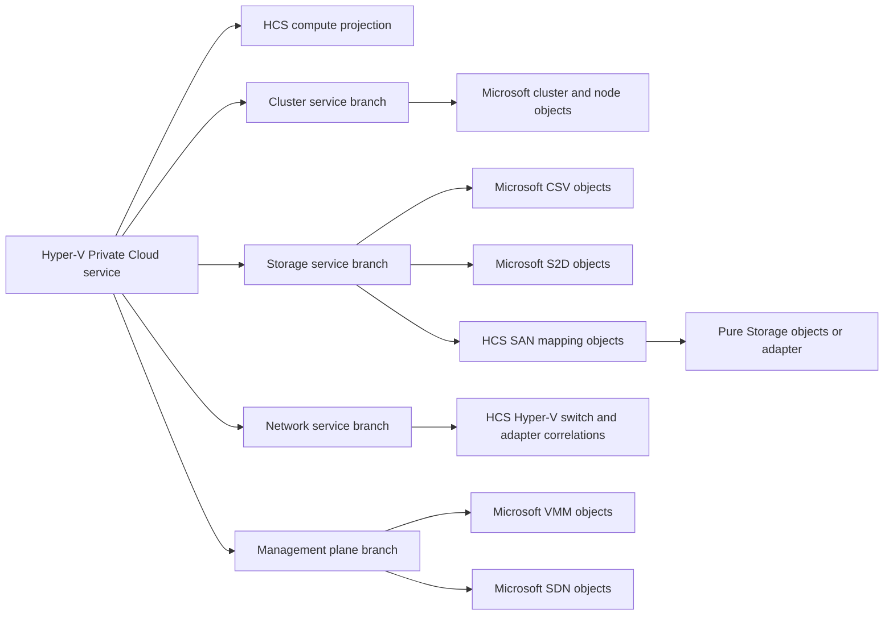

# Hyper-V Private Cloud v2 dependency and ownership contract

This contract implements
[ADR 0040](../decisions/0040-hyper-v-v2-microsoft-s2d-and-sdn-ownership.md), which supersedes the
pre-inspection assumptions in ADR 0039.

## Decision summary

Hyper-V Private Cloud Monitoring v2 reuses stable, public objects from supported sealed Microsoft
and vendor Management Packs when those packs already own the resource. HCS owns the private-cloud
service projection, missing domain objects, cross-domain correlations, and service-impact
relationships. It does not create a second cluster, cluster node, cluster network, cluster resource,
or Cluster Shared Volume identity merely to place that object in an HCS view.

The console product name is **Hyper-V Private Cloud Monitoring** and its monitoring root is
**Hyper-V Private Cloud**. Internal IDs use the new `HybridSolutionsCloud.HyperVPrivateCloud`
namespace. The public `HybridSolutionsCloud.HyperV` preview remains a separate compatibility
surface; v2 does not rename or repurpose its released element IDs.

## Verified Microsoft contracts

The following inventory was produced from the sealed, Microsoft-published packages, not inferred
from display names or documentation screenshots.

| Package inspected | Published version | Public contract relevant to v2 |
|---|---:|---|
| Operations Manager built-in Windows Cluster Library | `7.0.8447.6` in the OM2022 authoring reference set | `Microsoft.Windows.Cluster`, `Microsoft.Windows.Cluster.Service`, and `Microsoft.Windows.Cluster.VirtualServer`; no public CSV class |
| Windows Server Cluster 2016 and above | `10.1.0.0` | Public cluster component, node, node role, group, hosted group, network, resource, monitoring-service, and containment/hosting relationships |
| Windows Server Operating System 2016 and above | `10.1.2.2` | Public Windows Server computer, operating-system, disk, adapter, processor, and group model |
| Windows Server Cluster Shared Volume Monitoring | `10.1.2.2` | Public CSV and cluster-disk classes, CSV discovery, free-space monitors, performance collection, and dashboards |
| Storage Spaces Direct | `1.0.47.4` | Public storage subsystem, node, physical disk, pool, virtual disk, volume, file-share, group, and topology relationships; discovery, health, performance, and presentation |
| Windows Server SDN | `10.0.0.2` | Public stamp, controller-node, host, virtual-network, ACL, network-interface, MUX, virtual-gateway, connection, BGP, gateway-pool, and gateway model; discovery, health, collection, and views |

Microsoft's current SCOM guidance also says that the Windows Server Operating System Management
Pack provides CSV discovery and monitoring. That makes an HCS-owned parallel CSV identity an
integration defect for v2, not added coverage.

The inspected CSV MP exposes `Microsoft.Windows.Server.ClusterSharedVolumeMonitoring.`
`ClusterSharedVolume` with `ClusterSharedVolumeName` as its key and discovers it beneath the
Microsoft cluster virtual-server identity. The inspected Cluster MP exposes public containment from
`Microsoft.Windows.Cluster` to node, group, and network and hosting from hosted groups to cluster
resources. These are suitable endpoints for HCS-owned reference and service-membership
relationships. The S2D base library uses `UniqueID` keys for its public storage resources. The SDN
pack uses public `Id` keys for its non-singleton resources. These stable public identities are
suitable relationship endpoints and must not be duplicated by v2.

## Required and optional dependency boundary

| HCS v2 capability pack | External dependency | Policy |
|---|---|---|
| Core library, compute, and base presentation | Operations Manager built-in System, Windows, System Center, Health, Performance, and Service Designer libraries | Required; retain the lowest verified reference versions that contain the used types |
| Failover Cluster Integration | Microsoft Windows Server Cluster 2016 and above MPs, minimum package `10.1.0.0` | Optional for standalone; mandatory before importing the HCS cluster capability |
| CSV Integration | Microsoft Windows Server Operating System 2016 and above including `Microsoft.Windows.Server.ClusterSharedVolumeMonitoring`, minimum package `10.1.2.2` | Optional for standalone; mandatory before importing the HCS CSV/service-impact adapter |
| S2D Integration | Microsoft Storage Spaces Direct MP, minimum package `1.0.47.4`, plus its declared Microsoft Storage library | Never a core dependency; reuse Microsoft S2D objects and add only verified gaps, cluster/CSV/VM correlations, coverage, and service impact |
| SAN Core | Windows Server storage, MPIO, iSCSI, Fibre Channel, SMB, and cluster contracts | HCS owns common path/LUN/mapping projections only where no supported sealed MP owns them |
| Pure Storage Integration | Pure Storage FlashArray MP `2.0.120.0` for SCOM 2016/2019/2022 and Purity 5.3+ | Never a core dependency; reuse Pure arrays, controllers, hosts, host groups, ports, volumes, and pods; HCS adds the SAN-to-VM correlation chain and DA impact only |
| VMM Integration | Matching Microsoft VMM Management Packs for the supported VMM/SCOM version pair | Never a core dependency; reference VMM clouds, host groups, logical networks, logical switches, storage, and jobs instead of rediscovering them |
| SDN Integration | Microsoft Windows Server SDN MP, minimum package `10.0.0.2` | Never a core dependency; reuse Microsoft SDN objects and add only verified correlations, coverage, and service impact |
| SMB/SOFS Integration | Microsoft Windows Server File & iSCSI Services package `10.1.0.4` plus matching Cluster MPs for SOFS | Reuse Microsoft File Server, clustered SMB, iSCSI Target, cluster role/resource, and leaf health; HCS owns only missing share/path/VHDX/VM mappings and service impact |
| Physical Network Integration | Built-in SCOM network libraries matching the installed SCOM version | Reuse nodes, switches, ports/interfaces, VLANs, connections, server-port correlation, health, and performance; HCS adds private-cloud membership, coverage, and service impact |

An optional capability's presentation and Distributed Application population are packaged with or
behind that capability. The base presentation MP must not take every optional dependency and turn a
standalone installation into an all-or-nothing import.

## Object ownership rules

1. A supported sealed Microsoft or vendor class remains the authoritative identity when it
   represents the same real resource and exposes stable public keys.
2. HCS may define a relationship whose endpoint is an external public class. That is the normal
   mechanism for traversal into the private-cloud DA, diagram, state, alert, and performance views.
3. HCS defines a new class only for a missing concept, an HCS-owned service projection, or a
   materially different lifecycle/identity that cannot safely specialize the external class.
4. Discovery never submits a competing external object with guessed keys. Correlation must use the
   documented external keys and be proven in standalone, failover, rename, migration, and removal
   tests.
5. External leaf monitors remain the leaf alert authority. HCS dependency monitors roll their
   health into service impact without creating duplicate symptom alerts.
6. Optional dependencies are isolated in adapter MPs. Core compute remains importable and useful
   without Cluster, CSV, S2D, Pure, VMM, or SDN packs.

## SAN Core contract

`Capability.Storage` owns only the Windows-host projection that is not supplied as an equivalent
supported sealed model: a stable logical unit, its per-host attachment, iSCSI sessions, Fibre
Channel ports, and the VHDX-to-Windows-volume/disk/LUN mapping. Discovery uses `Get-Disk`, the
Storage volume/partition commands, `Get-IscsiSession`, `MPIO_DISK_INFO`, and
`MSFC_FibrePortHBAAttributes`. LUN keys are SHA-256 projections of the Windows unique ID or serial;
the raw identifiers remain properties for read-only vendor correlation.

The pack monitors Windows disk availability and writability, MPIO minimum path count, iSCSI session
connections, FC port state, and query-pipeline coverage. It does not configure MPIO claiming, DSM
policy, iSCSI targets, zoning, or array state. Pure owns FlashArray objects and alerts. Microsoft
owns S2D objects and alerts. Their optional adapters relate those authoritative objects to SAN Core
and the private-cloud DA; SAN and S2D discovery are independent and may be enabled together.

## S2D adapter contract

`Capability.S2D` defines no storage resource class. It relates the seven public Microsoft S2D
families—storage subsystem, node, physical disk, pool, virtual disk, volume, and file share—to the
private-cloud Storage component using their inherited `UniqueID` keys and complete hosting chains.
Seven dependency monitors roll `System.Health.AvailabilityState`; unavailable members are Success
so an absent optional family does not make a SAN-only or partially populated deployment unhealthy.

One HCS monitor checks only the local Storage query path on a Microsoft-discovered subsystem. The
Microsoft pack remains responsible for Health Service faults/actions, ongoing jobs, physical-disk
telemetry, subsystem/node/pool/volume/file-share health, alerts, and performance collection. HCS
views expose those authoritative objects and signals under the private-cloud Storage console root.
The adapter's sealed references use the lowest compatible `1.0.0.0` identity while the supported
installation floor remains the inspected Microsoft package `1.0.47.4`.

## v2 service graph

S2D and SAN branches are independent and may both populate the same private-cloud service. No
capability-detection path is allowed to disable the other.

## Pure Storage contract

[ADR 0041](../decisions/0041-hyper-v-v2-pure-storage-integration.md) approves the vendor-integrated
Pure lane for SCOM 2016, 2019, and 2022. The inspected sealed bundle is
`PureStorageFlashArray` `2.0.120.0`, public key token `a9d994eedb5e7179`. Its public model exposes:

- `PureStorage.FlashArray.PureArray`, keyed by `ArrayId`;
- `PureStorage.FlashArray.PureController`, `PureHost`, `PureHostgroup`, `PurePort`, and
  `PureVolume`, keyed within their hosting path by `Name`;
- `PureStorage.FlashArray.Pod`, keyed by `PodId`, and hosted `PodReplica`, keyed by `PodName`; and
- public array-hosting/containment relationships and the public
  `PureStorage.FlashArray.FlashArrayAdminAccount` Secure Reference.

The vendor pack remains responsible for leaf topology, alerts, capacity, performance, and
ActiveCluster pod/mediator health. The authored HCS adapter defines no competing Pure class and
uses no Pure Run As credential or REST control path. It correlates Pure host IQN/WWN values to
Windows iSCSI/FC initiators and Pure volume serials to HCS logical units only when the identity has
exactly one match. It then adds Pure arrays and ports to the private-cloud Storage branch and rolls
authoritative vendor availability health through four relationships. Existing HCS Storage and
core topology carries that impact onward to attached disks, VHDX files, hosts, VMs, and the DA.
The adapter does not acknowledge or close array alerts and does not enable vendor-disabled
high-cardinality volume performance workflows.

Pure's published support evidence does not include SCOM 2025. The v2 preflight therefore rejects
that combination until either Pure publishes support or a mutually exclusive HCS Purity REST 2.x
provider passes its own security, scale, migration, and representative-array gates.

## SMB/SOFS and physical network contracts

[ADR 0042](../decisions/0042-hyper-v-v2-file-services-and-physical-network-ownership.md) makes
Microsoft's File & iSCSI and built-in SCOM network objects authoritative. File & iSCSI Services
package `10.1.0.4` supports Windows Server and SCOM 2016, 2019, 2022, and 2025. The inspected public
model includes File Server, File Server service, SMB service, clustered SMB service, and iSCSI
Target service classes. HCS may add missing concrete SOFS share, Multichannel/RDMA path,
share-to-VHDX/VM correlation, coverage, and service-impact concepts.

The authored `Capability.FileServices` implements this boundary with three HCS-only projections:
an SMB share used by Hyper-V, a client Multichannel/RDMA path, and a share-to-VHDX mapping. Stable
SHA-256 identities are derived from normalized UNC, host/interface endpoints, and VM/disk keys.
Seven relationships attach these projections to the private-cloud Storage branch, Hyper-V hosts,
VMs/disks, and the exact Microsoft SMB service host identity. One HCS monitor validates only the
client-side dependency that Microsoft does not own: required connection presence, continuous
availability, and optionally RDMA. The pack defines no File Server or SMB service class and emits
no duplicate Microsoft leaf alert.

The built-in network libraries expose `System.NetworkManagement.Node`/`Switch`, hosted
`NetworkAdapter`/`Interface`/`Port`, `VLAN`, and `NetworkConnection`. Nodes use `DeviceKey`; hosted
adapters use `Key`. Public topology includes node-to-adapter, VLAN-to-adapter, adapter-peer, and
network-connection-to-`System.NetworkAdapter` relationships. HCS consumes those objects and
Microsoft's server-port correlation rather than rediscovering devices or handling SNMP secrets.

The authored `Capability.PhysicalNetwork` uses the public contract already present in the SCOM
2016 `System.NetworkManagement.Library` `7.2.11719.0`; the same required objects and relationship
were verified in the SCOM 2019 and 2022 libraries. `Microsoft.Windows.ComputerNetworkAdapter`
derives from `System.Device.NetworkAdapter` and carries the exact `DeviceID` key plus MAC address.
SCOM's built-in merging workflow matches `System.Device.NetworkAdapter` instances by MAC, writes
`System.NetworkManagement.NetworkConnectionConnectedToNetworkAdapter`, and computes peer topology.

HCS therefore defines only two relationships: the private-cloud Network branch contains the
participating Windows physical adapters, and each external Hyper-V virtual switch references its
Windows physical uplinks. It adds one local correlation-input health monitor, two dependency
rollups, and eight views. It does not define a network resource class, discover a switch or port,
read an SNMP credential, or emit a competing network-device alert. The local monitor proves the
identity inputs, not management-group topology completeness; the resulting SCOM network diagram is
a representative-lab and deployment verification gate.

## Preview migration boundary

The `0.1` preview is not upgraded by renaming its public elements. The v2 installer and guide must:

- detect the preview before import;
- prevent both products from actively monitoring the same workflows by default;
- preserve preview history for the documented retention/migration window;
- provide explicit disable/remove steps and dependency ordering; and
- state that preview overrides cannot be assumed compatible with the v2 namespace.

## Remaining contract spikes

The following dependencies are not approved until their exact public contracts are inspected and
recorded in this page:

- exact VMM MP IDs, classes, and keys from each supported, build-coupled SCOM/VMM pair; and
- the SCOM 2025 Pure Storage path, either vendor-certified or a separately approved read-only
  Purity REST 2.x provider.

## Sources

- [Microsoft Management Packs](https://learn.microsoft.com/en-us/system-center/scom/management-pack-list?view=sc-om-2025)
- [Monitoring Failover Cluster with Operations Manager](https://learn.microsoft.com/en-us/system-center/scom/manage-monitor-clusters-overview?view=sc-om-2025)
- [Windows Server Cluster 2016 and above MP 10.1.0.0](https://www.microsoft.com/en-us/download/details.aspx?id=54701)
- [Windows Server Operating System 2016 and above MP 10.1.2.2](https://www.microsoft.com/en-us/download/details.aspx?id=54303)
- [Storage Spaces Direct MP 1.0.47.4](https://www.microsoft.com/en-us/download/details.aspx?id=100782)
- [Windows Server SDN MP 10.0.0.2](https://www.microsoft.com/en-us/download/details.aspx?id=54300)
- [What is in an Operations Manager Management Pack?](https://learn.microsoft.com/en-us/system-center/scom/manage-overview-management-pack?view=sc-om-2025)
- [Pure Storage FlashArray PowerShell SDK 2](https://github.com/PureStorage-Connect/PowerShellSDK2)
- [Pure Storage FlashArray SCOM MP 2.0.120.0](https://github.com/PureStorage-Connect/SCOM-Management-Pack/releases/tag/v2.0.120.0)
- [Windows Server File & iSCSI Services MP 10.1.0.4](https://www.microsoft.com/en-us/download/details.aspx?id=57594)
- [Monitoring networks by using Operations Manager](https://learn.microsoft.com/en-us/system-center/scom/manage-monitor-networkdevice-overview?view=sc-om-2025)
- [MPIO WMI classes](https://learn.microsoft.com/en-us/windows-hardware/drivers/storage/mpio-wmi-classes)
- [`MPIO_DISK_INFO` WMI class](https://learn.microsoft.com/en-us/windows-hardware/drivers/storage/mpio-disk-info-wmi-class)
- [`MPIO_DRIVE_INFO` WMI class](https://learn.microsoft.com/en-us/windows-hardware/drivers/storage/mpio-drive-info-wmi-class)
- [`Get-Disk`](https://learn.microsoft.com/en-us/powershell/module/storage/get-disk?view=windowsserver2022-ps)
- [iSCSI PowerShell module](https://learn.microsoft.com/en-us/powershell/module/iscsi/?view=windowsserver2025-ps)
- [`MSFC_FibrePortHBAAttributes` WMI class](https://learn.microsoft.com/en-us/windows-hardware/drivers/storage/msfc-fibreporthbaattributes-wmi-class)
- [Fibre Channel HBA port-state values](https://learn.microsoft.com/en-us/windows-hardware/drivers/storage/msfc-hbaportattributesresults-wmi-class)
