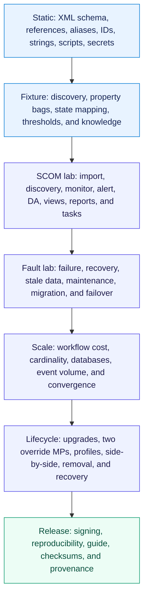
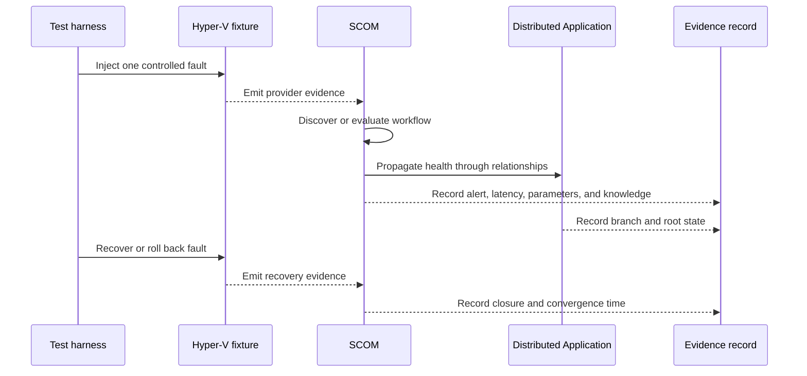
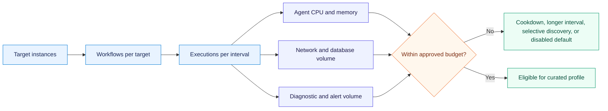
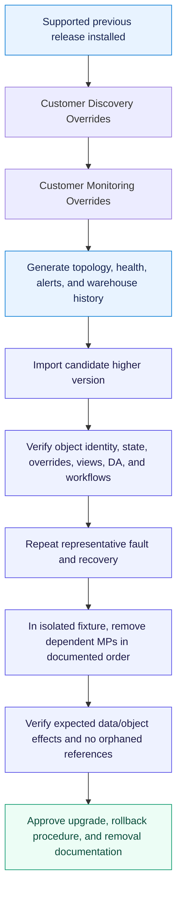

# Hyper-V validation and release architecture

No Management Pack moves directly from authoring to production. Microsoft recommends a
pre-production Operations Manager environment for reviewing and tuning new or updated MPs, with
version control and archived releases. See [Management Pack lifecycle](https://learn.microsoft.com/en-us/system-center/scom/manage-mp-lifecycle?view=sc-om-2025).

## Current authoring-host evidence

The v2 four-pack core and nine authored capability MPs pass VSAE
`VerifyMergedManagementPack` against their inspected OM2022/Microsoft/vendor dependency sets and
complete ordered test sealing with transient development identities. A generated Standard
Discovery/Monitoring override pair also passes VSAE; the expected unsealed-type warning identifies
its intentionally same-MP dynamic group. This proves authoring-host schema, reference, and sealing
paths. It does not replace release signing, clean SCOM import, workflow execution, fault/recovery,
scale, upgrade, or removal certification.

The v2 override CI gate builds all 13 product MPs, regenerates 11 deployment profiles times three
tuning tiers times two override kinds, and byte-compares all 66 committed examples. For every
override, it resolves the referenced product MP and workflow, verifies the context equals the
workflow target or a valid same-MP group populated from that target, resolves local modules, and
proves configuration parameters or workflow properties exist. It also checks alias use, capability
scoping, shared-data-source cookdown values, independent customer/product versions, schema and
capability rejection, cross-unsealed-MP group rejection, UTF-8 without BOM, and Default MP absence.

The core Library now defines public command-executor wrappers that launch
`%ProgramFiles%\PowerShell\7\pwsh.exe` explicitly. Static tests prove that every first-party script
declares PowerShell 7 and strict mode, every discovery/property-bag workflow returns native SCOM
data, and no legacy in-process Microsoft PowerShell workflow type remains. This resolves the
authoring-host design question; it does not prove agent runtime. The diagnostic task must be run
through HealthService in each claimed lane and its process, edition, version, home, automation
assembly, and bitness fields retained with the release evidence.

The read-only collector at
`tests/integration/Get-HyperVPrivateCloudCertificationSnapshot.ps1` makes that management-group
evidence repeatable. For a declared lane it verifies imported sealed identities, the separate
unsealed override MPs, minimum topology cardinality, authored workflows and views, Distributed
Application presence, and a recent diagnostic-task result. It emits a detailed snapshot and an
unapproved evidence draft. It deliberately cannot approve the fault/recovery, scale,
upgrade/override, removal, or before/after Default Management Pack gates; those require the
multi-phase procedures below and human review.

## Validation layers



## Continuous-integration flow

```mermaid
flowchart LR
    PR[Pull request] --> FORMAT[Markdown, XML, PowerShell, and resource checks]
    FORMAT --> BUILD[Compose and build MPs]
    BUILD --> VERIFY[Schema and Management Pack verification]
    VERIFY --> CONTRACT[Element, reference, catalog, and override contract tests]
    CONTRACT --> TESTSIGN[Test seal and sign]
    TESTSIGN --> ARTIFACT[Immutable test artifacts]
    ARTIFACT --> LAB[Approved pre-production deployment]
    LAB --> PROMOTE{All release evidence approved?}
    PROMOTE -->|No| FIX[Return to authoring]
    PROMOTE -->|Yes| SIGN[Release seal and sign]
    SIGN --> PUBLISH[Publish bundle and documentation]

    classDef source fill:#f5f3ff,stroke:#7c3aed,color:#3b0764
    classDef check fill:#eef2ff,stroke:#4f46e5,color:#1e1b4b
    classDef decision fill:#fff7ed,stroke:#ea580c,color:#7c2d12
    classDef output fill:#ecfdf5,stroke:#059669,color:#064e3b
    class PR source
    class FORMAT,BUILD,VERIFY,CONTRACT,TESTSIGN,LAB,FIX check
    class PROMOTE decision
    class ARTIFACT,SIGN,PUBLISH output
```



## Required lab matrix

| Axis | Minimum fixtures |
|---|---|
| SCOM | Every supported Operations Manager release/update baseline |
| Windows Server | Every supported Hyper-V host release and relevant edition |
| Topology | Standalone, failover cluster, and each accepted SCVMM/SDN variant |
| Networking | Eligible Network ATC, manual networking, and SCVMM/SDN authority |
| Storage | Local, CSV/shared storage, and each accepted SMB/SAN/virtual FC variant |
| VM lifecycle | Create, rename, start, stop, save, pause, checkpoint, move, remove, and restore |
| Cluster lifecycle | Join, drain, pause, failover, node loss, quorum/witness change, and rolling update |
| Monitoring | Agent loss, workflow timeout, access denied, stale data, bad output, and recovery |
| PowerShell host | Correct MSI path and Core edition, missing/relocated executable, timeout, malformed output, module compatibility, and recovery |
| Scale | Empty, typical, supported maximum, and limit-exceeded fixtures |

Research validation defines the exact supported matrix. A topology not represented by a repeatable fixture
cannot be listed as supported.

## Fault-to-evidence loop



Every threshold and stateful monitor requires both fault and recovery evidence. A test that proves
only that an alert opens is incomplete.

## Scale budget model



The final support matrix records limits for hosts, clusters, VMs, adapters, disks, relationships,
workflow runtime, and collected samples. Crossing a proven limit produces guidance or a pipeline
health condition rather than uncontrolled discovery.

## Governed sealing and release packaging

The v2 release packager derives the actual public key token before composing any product or
override reference, verifies source MPs through Microsoft VSAE, seals through VSAE `SealMp`, and
then verifies every strong name. It emits 13 individual sealed MPs, 66 public unsealed override
MPs, core/complete/override bundles, and one bundle for each of the 11 deployment profiles.

Publisher dependencies may be supplied as sealed `.mp` assemblies or publisher `.mpb` bundles. The
packager reads bundle identity through Microsoft's SCOM packaging SDK and records each selected
source filename, SHA-256 hash, MP ID, version, and publisher token in `dependencyEvidence`.
Because VSAE does not accept `.mpb` files as reference inputs, the working directory contains a
temporary sealed dependency graph whose bundle identities and transitive references use one
throwaway verification token. These files exist only to let VSAE resolve the same source content;
they are excluded from every asset. Publisher identity evidence and representative clean SCOM
import of the original prerequisites remain authoritative.

Every selected loose `.mp` also passes `sn.exe -vf`. For `.mpb`, the manifest records Authenticode
status, signer subject, and certificate thumbprint when present. The inspected Microsoft S2D and
VMM bundles validate as Microsoft-signed; Pure's official `2.0.120.0` GitHub bundle reports
`NotSigned`, so its exact source hash and the clean-import evidence must be retained explicitly.

Run a non-publishable packaging exercise with a transient key:

```powershell
./src/hyper-v/scom-mp/v2/tools/New-HyperVPrivateCloudReleasePackage.ps1 `
  -Version 2.0.0.0 `
  -SigningKeyPath D:/temporary-signing/transient-test.snk `
  -OutputPath D:/temporary-release/hyper-v-v2 `
  -BuildMode Test `
  -SkipSdkVerification

./src/hyper-v/scom-mp/v2/tools/Test-HyperVPrivateCloudReleasePackage.ps1 `
  -PackagePath D:/temporary-release/hyper-v-v2
```

This proves package composition only and records `releaseEligible=false`. Release mode cannot skip
VSAE. It also requires compatible sealed prerequisite directories, an approved permanent signing
identity, and a version-matched runtime evidence receipt. Publication adds
`-RequireReleaseEligible` to the validator.

ZIP entry order and timestamps are deterministic for one immutable sealed-input set. Microsoft
FASTSEAL itself writes new PE/module metadata on every compilation, so independent resealing is not
byte-reproducible. The release process preserves one approved sealed output set and publishes its
`release-manifest.json`, `release-assets.json`, and `SHA256SUMS.txt`; it does not claim that a later
FASTSEAL invocation will reproduce the same binary hash. See [ADR 0048](../decisions/0048-hyper-v-v2-governed-sealing-and-release-assets.md).

Production sealing and publication run only through the protected GitHub environment described in
the [Hyper-V v2 governed release runbook](./release-runbook.md). The workflow uses Azure OIDC,
materializes the permanent key only under runner temp, enforces Release-mode eligibility, retains
the exact validated assets, creates a non-overwriting GitHub release, and verifies the stable
latest-download URLs before the site can expose **Download now**.

## Upgrade and removal sequence



Removal can delete configuration and affect monitored data and dependent MPs. It is tested only in
an isolated management group and documented accurately; it is not presented as a zero-impact
rollback. Microsoft documents dependency and removal constraints in
[Import, export, and remove an Operations Manager Management Pack](https://learn.microsoft.com/en-us/system-center/scom/manage-mp-import-remove-delete?view=sc-om-2025).

## Release gates

- All proposed Hyper-V ADRs required by the release are accepted.
- The support matrix and monitoring catalog contain evidence for every enabled workflow.
- No unresolved schema, reference, best-practice, security, or secret-scan findings remain.
- The diagnostic task proves the explicit PowerShell 7 runtime path and engine in every supported
  SCOM/Windows Server lane, and every enabled capability module works in that process.
- Discovery converges correctly for every supported topology and lifecycle transition.
- Health and alerts open, roll up, suppress, recover, and close as designed.
- DA membership, branch health, diagram/state views, reports, dashboards, and SLO targets pass.
- Maximum-scale tests meet approved HealthService, database, and convergence budgets.
- Side-by-side import proves no runtime dependency on Azure Local or Microsoft Hyper-V 2019 MPs.
- Upgrade preserves stable identity and representative customer overrides.
- Separate Discovery and Monitoring override MPs import, export, upgrade, and remove as documented.
- All 11 deployment profiles emit separate Lab, Standard, and Strict Discovery/Monitoring MPs whose
  references match the selected capability set and product version and whose effective
  configuration matches the documented catalog in a representative management group.
- Static and lab checks prove that no product or test workflow writes customization to the Default
  Management Pack.
- The release bundle is reproducible and signed only after test artifacts are approved.
- Published docs contain the exact artifact versions, dependencies, known issues, and tuning advice.
