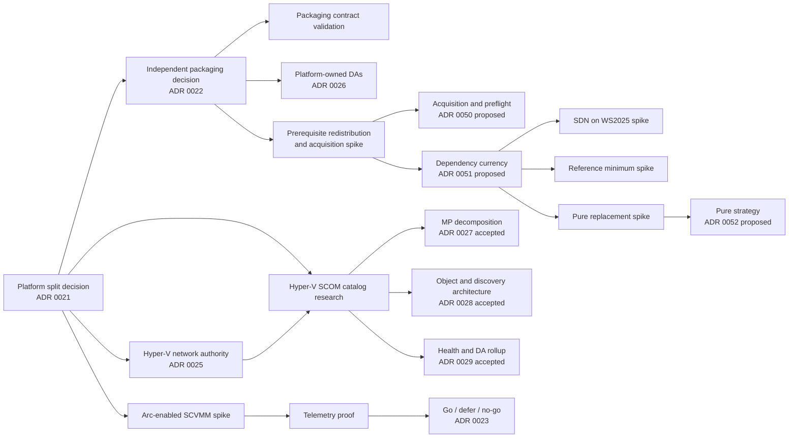

# Research spikes

Research is tracked as time-boxed research workstreams. Each spike must produce evidence,
update the relevant decision or release evidence, and identify executable follow-up work. A spike is not complete
when it merely collects links.

## Current spike backlog

| Spike | Platform / solution | Required evidence |
|---|---|---|
| Independent SCOM packaging contract | Both SCOM products | Separate artifact/namespace ownership, no-dependency reference graphs, signing, coexistence, upgrade, and removal evidence |
| Prerequisite redistribution rights and acquisition | Both SCOM products | Actual licence terms for every referenced Microsoft and vendor Management Pack, evidence of what comparable SCOM vendors ship, supported acquisition and preflight patterns, and the operator cost of the current link-only stance |
| SDN monitoring on Windows Server 2025 | Hyper-V / SCOM | Lab evidence that `Microsoft.Windows.10.SDNMonitoring` discovers and monitors a Failover Clustering-hosted Network Controller, or a decision to constrain or withdraw the SDN capability |
| Declared reference minimum validation | Both SCOM products | The oldest Microsoft and vendor Management Pack version each capability is validated against, with lab evidence, replacing minimums inherited from the build |
| Pure Storage monitoring replacement | Hyper-V / SCOM | Vendor support position on SCOM 2025, comparison of the native Purity OpenMetrics endpoint against a first-party REST 2.x capability pack, and a sized authoring estimate |
| Hyper-V SCOM monitoring catalog and DA refinement | Hyper-V / SCOM | Complete raw signal inventory, prior-MP research, SCOM workflow mapping, DA boundary/membership/rollup inputs, threshold evidence, lab validation, curated defaults, and successor ADR inputs |
| Azure Local SCOM local monitoring catalog | Azure Local / SCOM | Local API, Health Service, cluster, storage, Network ATC, registration, lifecycle, event, and performance inventory; curation and threshold evidence |
| Azure Local Health Models API and signal revalidation | Azure Local / Azure Monitor | Current API versions, preview limits, identity and RBAC contract, signal-source delta report |
| Arc-enabled SCVMM inventory and guest management | Hyper-V / Azure Monitor | ARM resource map, Arc Resource Bridge behavior, guest-management distinction, support and network matrix, repeatable lab steps |
| Hyper-V telemetry and Health Models feasibility | Hyper-V / Azure Monitor | Minimum viable entity graph, supported signals, fault-injection result, identity, latency, scale and cost findings |

## Planned ADR flow

## Dependency currency and supported-platform validation

The audit behind [ADR 0051](decisions/0051-dependency-currency-and-platform-validation.md) found that
the referenced Microsoft packs are **current, not stale** — four were re-released in May 2025, six
months after Windows Server 2025 and SCOM 2025 became generally available, and each explicitly states
support for both. "2016 and above" is version-agnostic naming, not a support ceiling. Three follow-on
spikes remain.

### SDN monitoring on Windows Server 2025

`Microsoft.Windows.10.SDNMonitoring` `10.0.0.2` is the only referenced pack whose download page does
**not** enumerate SCOM 2025 — it states only "SCOM 2016 and higher". Independently, Windows Server
2025 moved the Network Controller from Service Fabric hosted in virtual machines to a Failover
Clustering service on the host, and the pack's object model still describes the Service Fabric shape.

| # | Question | Evidence that closes it |
|---|---|---|
| 1 | Does the pack discover a Failover Clustering-hosted Network Controller? | Lab: Windows Server 2025 SDN stamp, FC-hosted Network Controller, SCOM 2025. Discovery results for `NetworkControllerClusterNode`, `Stamp`, `Gateway`, `LoadBalancerMux`, `VirtualNetwork`. |
| 2 | Do the 23 classes we consume all populate? | Instance counts per class against a known stamp topology. |
| 3 | Does health roll up correctly? | Fault injection on a Network Controller node and a Mux; observed state change. |
| 4 | Is the Run As profile contract unchanged on 2025? | `Microsoft.Windows.10.SDNMonitoring.NCRunAsProfile` configured against a 2025 Network Controller with REST certificate trust. |
| 5 | If it does not work, what is the fallback? | Decide: constrain the capability to Service Fabric deployments, or withdraw it. |

### Declared reference minimum validation

Declared minimums were inherited from whatever we happened to build against, not established by test.
Two are already known to be lower than the sealed-against version — `Microsoft.Storage.Library`
`1.0.0.0` against `1.0.47.4`, and `Microsoft.Windows.FileServices` `10.1.0.3` against `10.1.0.4`.

| # | Question | Evidence that closes it |
|---|---|---|
| 1 | What is the oldest version of each referenced pack the capability actually works against? | Import and functional test per capability against successively older publisher packages. |
| 2 | What are the real VMM management pack versions? | Read them from `…\Virtual Machine Manager\ManagementPacks` on System Center 2025 VMM media. Microsoft does not publish these. Our declaration is inconsistent — `PRO.V2.Library` at `10.25.1200.0` is the VMM 2025 GA build, the other three at `11.19.0.3` have no public attestation. |
| 3 | Which declared references are unused and removable? | Already identified: `Microsoft.Windows.FileServices` in `Capability.FileServices` and `Microsoft.Storage.Library` in `Capability.S2D` are declared and never consumed. Confirm no others, then remove in the next version. |

### Pure Storage monitoring replacement

The vendor pack states support for SCOM 2016, 2019 and 2022 only, and has had no commit since
2 October 2024. See [ADR 0052](decisions/0052-pure-storage-monitoring-strategy.md).

| # | Question | Evidence that closes it |
|---|---|---|
| 1 | Will Pure support SCOM 2025? | A written position from Pure. Escalate — the absence of a "no" is not a "yes". |
| 2 | Native Purity OpenMetrics endpoint or our own REST 2.x capability pack? | Metric coverage comparison against what the vendor pack exposes today, and against what `Capability.PureStorage` actually consumes: `PureArray`, `PureHost`, `PurePort`, `PureVolume`. |
| 3 | What would authoring our own cost? | Sized estimate covering discovery model, class hierarchy, monitors, rollup, views, alert knowledge, overrides, and management-server targeting — the last being where the vendor pack is defective. |
| 4 | Does the everpuredata.com rebrand affect vendor support? | Establish what changed and whether SCOM support survives it. |

## Prerequisite redistribution rights and acquisition

The optional Hyper-V capability Management Packs take hard references on Microsoft and vendor
Management Packs that this product does not redistribute
([ADR 0043](decisions/0043-hyper-v-v2-package-and-deployment-profile-architecture.md),
[ADR 0048](decisions/0048-hyper-v-v2-governed-sealing-and-release-assets.md)). On the first real
`1.0.0.0` import, four of nine capability packs — Cluster, File Services, SDN, and Pure Storage —
failed with *"The dependencies for this management pack cannot be located."* The behaviour is
correct; the operator experience is not.

ADR 0043 permits redistribution *"unless their license explicitly permits it"*. That conditional has
never been evaluated. This spike exists to evaluate it and to establish what comparable products do.

### Required evidence

| # | Question | Evidence that closes it |
|---|---|---|
| 1 | May we redistribute each referenced **Microsoft** MP? | The actual licence terms shipped inside each download (ids 54701, 54303, 57594, 54300, 100782), quoted, with the redistribution clause identified. A download-page summary is not sufficient — read the EULA in the package. |
| 2 | May we redistribute the **VMM** MPs? | These ship on System Center installation media rather than a public download. Licence position stated with a citation, including whether media-sourced packs differ from Download Center packs. |
| 3 | May we redistribute the **Pure Storage FlashArray** MP? | The `LICENSE` file from the vendor repository, quoted, and whether it permits third-party redistribution. |
| 4 | What do comparable SCOM vendors actually ship? | Concrete observed examples — do any redistribute Microsoft MPs inside their installer, or do all document prerequisites? Name the products and cite what was observed. |
| 5 | Is auto-import of prerequisites a supported pattern? | Whether SCOM can resolve a missing reference at import (expected: no), what `Import-SCOMManagementPack`-based deployment implies, and the documented risks of importing a publisher MP into a customer management group — version overwrite, support posture, and monitoring change. |
| 6 | What does authoring guidance say? | Position from the curated sources in [`REFERENCES.md`](https://github.com/Hybrid-Solutions-Cloud/hybrid-health-monitoring/blob/main/REFERENCES.md) — Kevin Holman, Brian Wren / MPAuthor, and the System Center authoring guide — on dependencies an author does not own. |
| 7 | What does the current stance actually cost an operator? | Measured: number of external sources to visit, packs to identify, and failed imports observed before prerequisites are satisfied. Partially answered already — four failed imports, three Microsoft download pages, one GitHub release. |

### Findings to date (2026-08-30)

Items 1–4 are **partially closed**. The determinative document for the Microsoft packs — the EULA
inside each MSI — has **not** been read, so item 1 stays open.

**Microsoft's default position is that redistribution is prohibited unless expressly granted.**
[Use of Microsoft Copyrighted Content](https://www.microsoft.com/en-us/legal/intellectualproperty/copyright/permissions):

> Unless expressly permitted in the accompanying License Terms or End-User License Agreement (EULA),
> Microsoft does not allow redistribution.

The [Microsoft Terms of Use](https://www.microsoft.com/en-us/legal/terms-of-use) add that
reproduction or redistribution "not in accordance with the License Agreement is expressly prohibited
by law". Silence is a refusal, not permission.

**No redistribution instrument exists for management packs.** Microsoft publishes explicit
redistribution terms where it intends redistribution — Visual Studio redistributables, SQL Server
Express. Nothing analogous exists for MPs. None of the five download pages (54701, 54303, 57594,
54300, 100782) carries licence text or a "redistributable" designation.

**Linking constraint, and we were in breach of it.** The same Microsoft page states:

> You may link to the download page, but not directly to the download.

The prerequisites page deep-linked the SCVMM media ZIP in five places, generated from
`officialMedia` in `contracts/dependencies.v2.json`. Corrected to a documentation page. All other
prerequisite links already pointed at `details.aspx` pages and were compliant.

**VMM packs are worse, not better.** Some VMM MPs are publicly downloadable (id=54113), but the
versions this product references come from System Center installation media, covered by a paid
product licence with no public download and no redistribution instrument. Treat as prohibited.

**Pure Storage is the exception.** The vendor repository is **Apache-2.0** (verified via the GitHub
licence API; `LICENSE.md`, standard Apache 2.0 text). That is a genuine redistribution grant,
subject to §4 — retain notices, ship the licence, state changes — and §6, which grants no trademark
rights. **Caveat:** the repository also contains an unread `EndUserLicenseAgreement.pdf`, so it is
ambiguous whether Apache-2.0 or that EULA governs the shipped `.mpb`. Read it before relying on the
grant.

**No precedent for redistributing Microsoft MPs.** No verified example of any third party shipping
Microsoft MP binaries in their own installer. The community MP catalogue stores metadata and links
only. Microsoft's own guidance for the mirror-image case — third-party MPs — is "obtain them
directly from those companies". The sanctioned model is publisher-sourced in both directions.

**Still open:** item 1 (read the EULA inside an MSI — `msiexec /a <msi> /qb TARGETDIR=…`, or open the
MSI's `Binary` table; the four packs may differ), and item 3's EULA caveat.

**Items 4–6 are closed, and they validate the link-only stance.** Microsoft's current documentation
states the expectation of a publisher directly —
[What is in an Operations Manager Management Pack?](https://learn.microsoft.com/en-us/system-center/scom/manage-overview-management-pack?view=sc-om-2025):

> You must import all referenced management packs before you can import the management pack that
> depends on those management packs. **Management packs include a management pack guide that should
> document the dependencies of the management pack.**

Documentation, not redistribution. Microsoft applies this to itself: its own Windows Server Cluster
MP — one of our prerequisites — depends on the Windows Server OS MP and does not ship it. Every
vendor checked does the same: Veeam MP for Hyper-V (points at the SCOM online catalog for
`Microsoft.SystemCenter.2007` and the Data Warehouse Library), IDERA SQL Diagnostic Manager,
Pure Storage, SquaredUp dashboard packs, and Cookdown's migration guidance. Kevin Holman's own
published MPs document the Windows Server OS MP as a hard operator prerequisite rather than shipping
it.

**Redistribution would be actively harmful, independent of licensing.** Sealed MPs cannot be
downgraded —
[Version Control](https://learn.microsoft.com/en-us/previous-versions/system-center/operations-manager-2007-r2/ff719639(v=technet.10)):

> When a new version of a sealed management pack is installed in a management group, the version that
> is installed must be a version later than the installed version. If the version is the same or an
> earlier version than the installed version, the management pack does not install.

Shipping a pinned copy could push a customer's management group irreversibly forward.

**Four defects this research exposed in our own product** — these are ours, not the policy's:

1. **Reference versions may be build-time rather than minimum-supported.**
   [MP References](https://learn.microsoft.com/en-us/archive/technet-wiki/15305.operations-manager-management-pack-authoring-management-pack-references)
   confirms a reference version is a *minimum*. A `<Version>` higher than we actually require is a
   self-inflicted prerequisite failure on estates that are already adequately equipped. Our declared
   minimums have never been audited against what the packs genuinely need.
2. **The online catalog can resolve Microsoft prerequisites, and we do not tell operators.** The
   console's *Add from disk* flow offers an Online Catalog Connection prompt; answering **Yes** lets
   SCOM fetch dependencies from Microsoft's catalog. All five of our Microsoft prerequisites are in
   that catalog. Needs verifying on SCOM 2022/2025 before documenting — the supporting evidence is
   vendor documentation predating those versions.
3. **Public key token mismatch produces the identical error.** A re-sealed or community-modified copy
   of a Microsoft MP satisfies the ID but not the token, and reports "dependencies cannot be located"
   even though the pack is present. Not covered in our troubleshooting.
4. **`Microsoft.SystemCenter.SecureReferenceOverride` blocks uninstall.** Our VMM, SDN, and Pure
   Storage capabilities define Run As profiles, so SCOM writes references into that pack and removal
   fails until they are cleared. Veeam maintains a KB for exactly this. We have no documented
   uninstall path.

**Attribution note:** the exact console string *"The dependencies for this management pack cannot be
located"* does not appear in Microsoft's documentation — it is console UI text. Cite
[KB2698846](https://learn.microsoft.com/en-us/troubleshoot/system-center/scom/cannot-import-management-pack-with-dependencies)
for the condition, not for that wording.

### Outcome

Evidence feeds [ADR 0050](decisions/0050-prerequisite-acquisition-and-preflight.md), which proposes
keeping the link-only stance and closing the gap with a read-only preflight command. The findings
above **support** that proposal for the Microsoft packs. Pure Storage is the one candidate where
bundling may be permissible; if the unread EULA confirms the Apache-2.0 grant covers the binary,
raise a successor ADR for that pack specifically — do not reopen the decision globally on a partial
finding.

## Hyper-V SCOM phase-one child spikes

The Hyper-V SCOM research program is divided into bounded spikes that can execute in the dependency
order shown on the [Hyper-V monitoring research](../hyper-v/monitoring-research.md) page.

Their evidence validates and refines the accepted
[MP decomposition](decisions/0027-hyper-v-scom-management-pack-decomposition.md),
[object/discovery architecture](decisions/0028-hyper-v-object-and-discovery-architecture.md), and
[health/DA rollup](decisions/0029-hyper-v-health-alert-and-da-rollup.md) decisions.

| Spike | Focus |
|---|---|
| Support and topology | Support matrix, topology, DA boundary keys, and candidate membership |
| Windows Server | Windows Server host and platform signals |
| Hyper-V and VMs | Hyper-V, hypervisor, and VM signals |
| Failover Clustering | Failover Cluster, quorum, and CSV signals |
| Storage and Replica | Storage, VHD/VHDX, and Replica signals |
| Networking | Network ATC, manual, and SCVMM/SDN Hyper-V networking signals |
| Prior MP analysis | Existing Microsoft MP research inputs; no runtime dependency or reuse of its package |
| SCOM workflow mapping | Supported SCOM workflow, dynamic DA membership, rollup mapping, and cost |
| Threshold engineering | Threshold, duration, recovery, and tuning policy |
| Lab validation | Lab source, fault, latency, recovery, and overhead validation |
| Catalog curation | Final Must/Should/Could/collect-only/excluded catalog |
| Architecture validation | Trace all architecture contracts to evidence and raise successor ADRs for any material change |

## Azure Local SCOM research program

The first desk-research pass and design synthesis are complete. The resulting
[research record](../azure-local/scom/monitoring-research.md) separates everything observable from the
curated [monitoring catalog](../azure-local/scom/monitoring-catalog.md), and ADRs 0032–0035 record the
implemented local-runtime, packaging, topology/DA, and health/alert decisions.

Lab evidence is still required for multi-node discovery reconciliation, Health Service fault and
recovery behavior, Network ATC status variants, update-state transitions, event IDs, cookdown,
threshold duration, scale, maintenance, upgrade, and removal. Findings that change public behavior
must produce successor ADRs instead of silently changing accepted decisions.

## Spike completion contract

Every spike must include:

1. the question and explicit non-goals;
2. first-party source citations and tested product versions;
3. repeatable lab steps, fixtures, or API queries;
4. observed results, including negative results and unsupported paths;
5. risks, gaps, cost, scale, and security implications;
6. a recommendation with confidence level; and
7. ADR and backlog updates driven by the evidence.
