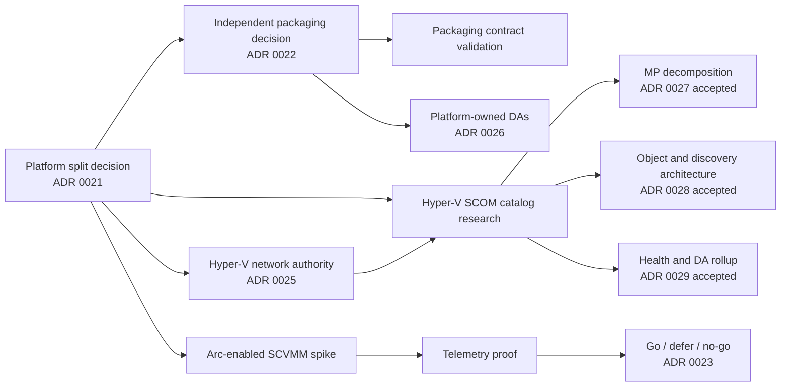

# Research spikes

Research is tracked as time-boxed research workstreams. Each spike must produce evidence,
update the relevant decision or release evidence, and identify executable follow-up work. A spike is not complete
when it merely collects links.

## Current spike backlog

| Spike | Platform / solution | Required evidence |
|---|---|---|
| Independent SCOM packaging contract | Both SCOM products | Separate artifact/namespace ownership, no-dependency reference graphs, signing, coexistence, upgrade, and removal evidence |
| Hyper-V SCOM monitoring catalog and DA refinement | Hyper-V / SCOM | Complete raw signal inventory, prior-MP research, SCOM workflow mapping, DA boundary/membership/rollup inputs, threshold evidence, lab validation, curated defaults, and successor ADR inputs |
| Azure Local SCOM local monitoring catalog | Azure Local / SCOM | Local API, Health Service, cluster, storage, Network ATC, registration, lifecycle, event, and performance inventory; curation and threshold evidence |
| Azure Local Health Models API and signal revalidation | Azure Local / Azure Monitor | Current API versions, preview limits, identity and RBAC contract, signal-source delta report |
| Arc-enabled SCVMM inventory and guest management | Hyper-V / Azure Monitor | ARM resource map, Arc Resource Bridge behavior, guest-management distinction, support and network matrix, repeatable lab steps |
| Hyper-V telemetry and Health Models feasibility | Hyper-V / Azure Monitor | Minimum viable entity graph, supported signals, fault-injection result, identity, latency, scale and cost findings |

## Planned ADR flow

## Hyper-V SCOM phase-one child spikes

The Hyper-V SCOM research program is divided into bounded spikes that can execute in the dependency
order shown on the [Hyper-V monitoring research](../hyper-v/monitoring-research.md) page.

Their evidence validates and refines the accepted
[MP decomposition](decisions/0027-hyper-v-scom-management-pack-decomposition.md),
[object/discovery architecture](decisions/0028-hyper-v-object-and-discovery-architecture.md), and
[health/DA rollup](decisions/0029-hyper-v-health-alert-and-da-rollup.md) decisions.

| Spike | Focus |
|---|---|
| Support and topology | Support matrix, topology, DA boundary keys, and candidate membership |
| Windows Server | Windows Server host and platform signals |
| Hyper-V and VMs | Hyper-V, hypervisor, and VM signals |
| Failover Clustering | Failover Cluster, quorum, and CSV signals |
| Storage and Replica | Storage, VHD/VHDX, and Replica signals |
| Networking | Network ATC, manual, and SCVMM/SDN Hyper-V networking signals |
| Prior MP analysis | Existing Microsoft MP research inputs; no runtime dependency or reuse of its package |
| SCOM workflow mapping | Supported SCOM workflow, dynamic DA membership, rollup mapping, and cost |
| Threshold engineering | Threshold, duration, recovery, and tuning policy |
| Lab validation | Lab source, fault, latency, recovery, and overhead validation |
| Catalog curation | Final Must/Should/Could/collect-only/excluded catalog |
| Architecture validation | Trace all architecture contracts to evidence and raise successor ADRs for any material change |

## Azure Local SCOM research program

The first desk-research pass and design synthesis are complete. The resulting
[research record](../azure-local/scom/monitoring-research.md) separates everything observable from the
curated [monitoring catalog](../azure-local/scom/monitoring-catalog.md), and ADRs 0032–0035 record the
implemented local-runtime, packaging, topology/DA, and health/alert decisions.

Lab evidence is still required for multi-node discovery reconciliation, Health Service fault and
recovery behavior, Network ATC status variants, update-state transitions, event IDs, cookdown,
threshold duration, scale, maintenance, upgrade, and removal. Findings that change public behavior
must produce successor ADRs instead of silently changing accepted decisions.

## Spike completion contract

Every spike must include:

1. the question and explicit non-goals;
2. first-party source citations and tested product versions;
3. repeatable lab steps, fixtures, or API queries;
4. observed results, including negative results and unsupported paths;
5. risks, gaps, cost, scale, and security implications;
6. a recommendation with confidence level; and
7. ADR and backlog updates driven by the evidence.
