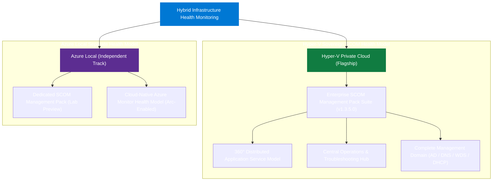

## What this project is

This project defines production-grade health monitoring for enterprise **Hyper-V Private Clouds** and **Azure Local hybrid infrastructure**. 

**Hyper-V Private Cloud Monitoring is the flagship solution**: a fully realized, production-ready SCOM management pack suite engineered specifically for private cloud virtualization fabrics—encompassing host compute, virtual machines, failover clustering, storage fabrics (CSV, S2D, SAN, Pure Storage), physical and software-defined networking, and core management domain services (Active Directory, DNS, PXE/WDS).

**Azure Local** is maintained as a completely separate, independent product track with its own dedicated SCOM and Azure Monitor delivery surfaces.

::: important Two completely separate health models
Hyper-V Private Cloud and Azure Local are **not part of the same health model**. They are two separate platforms with distinct operational boundaries, independent Management Pack suites, and zero shared runtime dependencies:
- **Hyper-V Private Cloud** runs 100% on-premises via System Center Operations Manager (SCOM 2019, 2022, 2025) with PowerShell 7+. It has no dependency on Azure Arc, Azure Monitor, or cloud connectivity.
- **Azure Local** (formerly Azure Stack HCI) is an independent platform track with its own distinct SCOM management pack and separate cloud-native Azure Monitor health models.
:::

## Sovereign platform architectures

## Solution tracks at a glance

| Platform | Delivery Track | Health Model Status | Architecture & Runtime |
|---|---|---|---|
| **Hyper-V Private Cloud (Flagship)** | SCOM Management Pack Suite | **Production Release (1.3.5.0)** | "Private Cloud Powered by Hyper-V: A 360° View" — 100% on-premises SCOM (2019 / 2022 / 2025), PowerShell 7+, zero cloud dependency |
| **Azure Local** | SCOM Management Pack | Lab Preview | Independent SCOM management pack for Azure Local HCI clusters |
| **Azure Local** | Azure Monitor Health Models | Committed Cloud Track | Cloud-native observability via Azure Arc and Azure Monitor |

::: tip Sovereign operation for Hyper-V
The Hyper-V Private Cloud solution has no Azure Monitor or Azure Arc requirement. All topology discovery, health evaluation, property-bag probing, alert rules, and diagnostic tasks execute locally on-premises via SCOM agents.
:::

## Companion tooling

[SquaredUp DS](https://ds.squaredup.com) and [SquaredUp Cloud](https://squaredup.com) are optional
visualization layers for SCOM and Azure Monitor environments respectively.

[ServiceNow integration](integrations/servicenow.md) provides an enterprise connector baseline for Event Management, CMDB correlation, and automated incident workflows.

## Project status

::: info Hyper-V SCOM release available
Hyper-V Private Cloud Monitoring `1.3.5.0` is the current sealed production release ("Private Cloud Powered by Hyper-V: A 360° View") and is available from
the [Hyper-V download page](/downloads/hyper-v-private-cloud). Azure Local remains an independent development
track. See the [project roadmap](/project/roadmap) for upcoming milestones.
:::

| Phase | Description | Status |
|---|---|---|
| 0 | Research and planning | Complete |
| 1 | Documentation scaffold | Complete |
| 2 | Azure Local health-model design baseline | Complete |
| 3 | Platform split, delivery hierarchy, ADR and spike planning | Complete |
| 4 | Research and architecture gates | Initial decisions complete; lab evidence active |
| 5 | Azure Local and Hyper-V development baselines | Complete |
| 6 | SCOM lab, Azure, ServiceNow, and release certification | Active |
