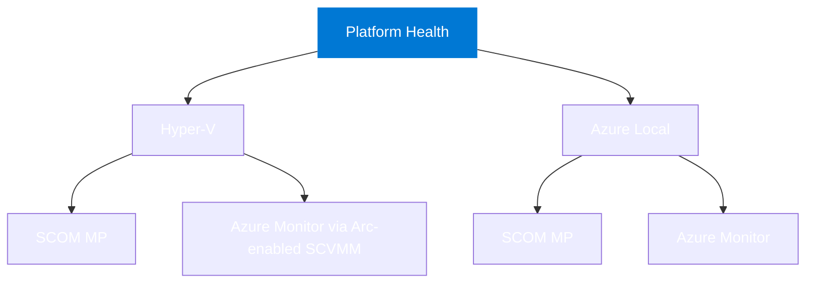

## What this project is

This project defines production-grade health monitoring for **Hyper-V and Azure Local
infrastructure** at the health-model level, rather than treating monitoring as a collection of
unrelated metric thresholds. Planning is organized by platform first and delivery surface second.

## Health model components

Both platforms use the same health-model grammar while retaining their own supported topology:

## Tracks at a glance

| Platform | SCOM Management Pack | Azure Monitor Health Models |
|---|---|---|
| **Azure Local** | Committed | Committed |
| **Hyper-V** | Committed | Constrained development; live validation and parity gates |

## Companion tooling

[SquaredUp DS](https://ds.squaredup.com) and [SquaredUp Cloud](https://squaredup.com) are optional
visualization layers for the SCOM and Azure Monitor tracks respectively.

[ServiceNow integration](integrations/servicenow.md) has a SCOM connector development baseline and
separate SCOM and Azure Monitor paths for Event Management, CMDB correlation, and incident workflows.

## Project status

::: info Independent development baselines are implemented
Azure Local and Hyper-V have separate functional SCOM Management Pack and Distributed Application
baselines. Azure Local and constrained Hyper-V Health Model baselines compile with Bicep. The
SCOM-to-ServiceNow mapping/profile baseline also passes offline validation. Both SCOM suites pass
Microsoft VSAE/SDK verification and ordered transient test sealing. Release signing and live SCOM,
Azure, and ServiceNow certification gates remain. See the [project roadmap](/project/roadmap) and
[implementation plan](https://github.com/Hybrid-Solutions-Cloud/hybrid-health-monitoring/blob/main/PLAN.md).
The sealed SCOM suites are available for controlled testing from the
[lab-preview download page](/downloads/scom-lab-preview).
:::

| Phase | Description | Status |
|---|---|---|
| 0 | Research and planning | Complete |
| 1 | Documentation scaffold | Complete |
| 2 | Azure Local health-model design baseline | Complete |
| 3 | Platform split, delivery hierarchy, ADR and spike planning | Complete |
| 4 | Research and architecture gates | Initial decisions complete; lab evidence active |
| 5 | Azure Local and Hyper-V development baselines | Complete |
| 6 | SCOM lab, Azure, ServiceNow, and release certification | Active |
