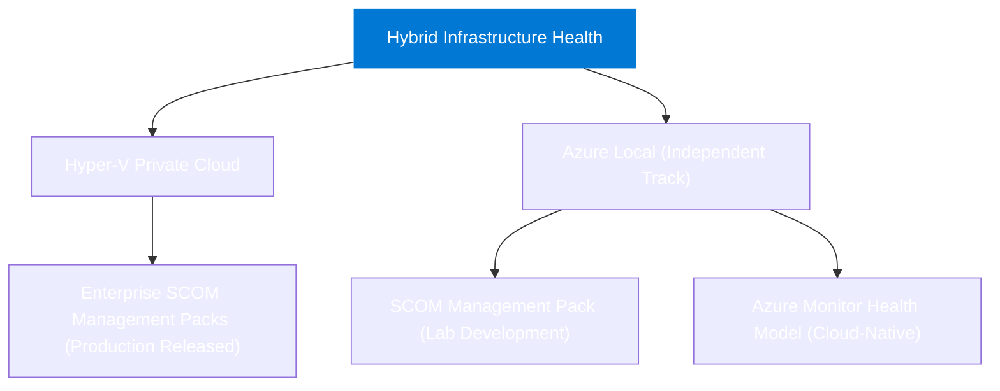

## What this project is

This project defines production-grade health monitoring for enterprise **Hyper-V Private Clouds** and **Azure Local hybrid infrastructure**. 

Hyper-V Private Cloud Monitoring is the primary flagship solution: a fully realized, production-ready SCOM management pack suite architected for complete visibility into host compute, virtual machines, failover clustering, storage fabrics, physical and virtual networks, and management domain services. Azure Local is maintained as a completely separate, independent product track with its own dedicated SCOM and Azure Monitor delivery surfaces.

## Platform architecture

Both platforms are architecturally distinct and share zero runtime dependencies:

## Tracks at a glance

| Platform | Delivery Track | Status | Primary Use Case |
|---|---|---|---|
| **Hyper-V Private Cloud** | SCOM Management Pack Suite | **Production Release (1.0.6.0)** | Enterprise on-premises private clouds, Failover Clusters, SCVMM, SAN/S2D/Pure, SDN, AD/DNS |
| **Azure Local** | SCOM Management Pack | Lab Development | On-premises SCOM monitoring for Azure Local clusters |
| **Azure Local** | Azure Monitor Health Models | Committed Cloud-Native Track | Cloud-native observability via Azure Arc and Azure Monitor |

::: tip Completely independent solutions
Hyper-V Private Cloud and Azure Local have separate design, source, deployment, and release boundaries. The Hyper-V suite runs 100% on System Center Operations Manager without any cloud or Azure Monitor dependencies.
:::

## Companion tooling

[SquaredUp DS](https://ds.squaredup.com) and [SquaredUp Cloud](https://squaredup.com) are optional
visualization layers for SCOM and Azure Monitor environments respectively.

[ServiceNow integration](integrations/servicenow.md) provides an enterprise connector baseline for Event Management, CMDB correlation, and automated incident workflows.

## Project status

::: info Hyper-V SCOM release available
Hyper-V Private Cloud Monitoring `1.0.6.0` is the current sealed production release and is available from
the [Hyper-V download page](/downloads/hyper-v-private-cloud). Azure Local remains an independent development
track. See the [project roadmap](/project/roadmap) for upcoming milestones.
:::

| Phase | Description | Status |
|---|---|---|
| 0 | Research and planning | Complete |
| 1 | Documentation scaffold | Complete |
| 2 | Azure Local health-model design baseline | Complete |
| 3 | Platform split, delivery hierarchy, ADR and spike planning | Complete |
| 4 | Research and architecture gates | Initial decisions complete; lab evidence active |
| 5 | Azure Local and Hyper-V development baselines | Complete |
| 6 | SCOM lab, Azure, ServiceNow, and release certification | Active |
