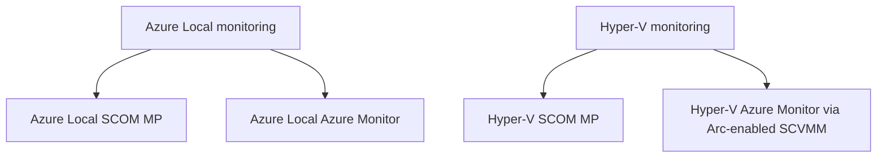
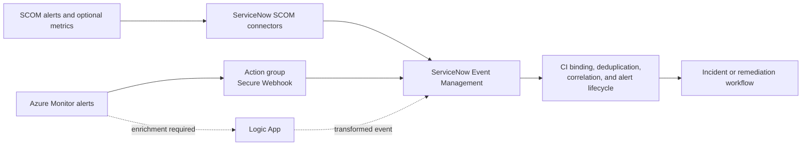

# Roadmap

The roadmap is organized by platform first and solution second. This page is the public delivery
summary. Repository and publishing identity are governed by
[ADR 0024](../design/decisions/0024-repository-and-publishing-identity.md).

## Portfolio structure

| Epic | Delivery feature | Commitment | Status |
|---|---|---|---|
| Azure Local monitoring | Azure Local SCOM MP | Committed | Functional development MP authored; release certification active |
| Azure Local monitoring | Azure Local Azure Monitor | Committed | Preview development baseline authored; live validation active |
| Hyper-V monitoring | Hyper-V SCOM MP | Committed | Functional development MP authored; release certification active |
| Hyper-V monitoring | Hyper-V Azure Monitor through Arc-enabled SCVMM | Constrained | Development baseline authored; lab and parity gates active |

## Now — certification and evidence gates

These items unblock safe implementation:

| Item | Outcome | Dependency |
|---|---|---|
| Independent SCOM packaging contract | Validate independent namespaces, artifacts, signing, coexistence, upgrade, and removal behavior | Implements accepted ADR 0022 for both SCOM Features |
| Azure Local SCOM release certification | VSAE verification and transient test sealing complete; clean-import and exercise discovery, health, DA, lifecycle, coexistence, and removal | Gates the first Azure Local MP release |
| Hyper-V SCOM monitoring research | Validate and extend the implemented catalog through exhaustive signal inventory, workflow/threshold research, lab evidence, and curated defaults | Active; gates released defaults and later coverage |
| Hyper-V SCOM release certification | VSAE verification and transient test sealing complete; import in standalone/cluster labs, exercise fault/recovery and lifecycle, then release-sign | Gates the first public MP release |
| Azure Local Health Models revalidation | Revalidate APIs, preview limits, identity, and signal contracts | Gates Azure Local Azure Monitor authoring |
| Arc-enabled SCVMM inventory spike | Validate inventory identity and guest-management boundaries in the lab | Initial desk research complete |
| Hyper-V Health Models feasibility | Validate the authored model, DCR, live schemas, fault behavior, gaps, scale, and cost | Constrained go recorded; release gate active |

See [Research spikes](../design/research-spikes.md) for the evidence contract.
The complete phase-one Hyper-V breakdown is published in
[Hyper-V SCOM monitoring research](../hyper-v/monitoring-research.md).

## Next — committed delivery

### Azure Local SCOM Management Pack

1. ~~Author classes, discoveries, and DA membership.~~ Complete in the development baseline.
2. ~~Author monitoring, DA rollups/operator surfaces, and overrides.~~ Complete in the development baseline.
3. ~~Resolve the installed SCOM 2022 dependencies and run Microsoft VSAE/SDK verification.~~
   Complete for all five projects.
4. ~~Test-seal the Library, Discovery, Monitoring, Presentation, and optional Reporting artifacts
   in dependency order.~~ Complete with a transient development key. Next, clean-import them in the
   Azure Local lab.
5. Validate topology, Health Service faults, Network ATC, lifecycle state, DA population/rollup,
   tuning, maintenance, scale, upgrade, coexistence, and removal; then sign and publish.

### Azure Local Azure Monitor

1. ~~Revalidate the current preview API and initial signal contract.~~ Complete for the development baseline.
2. ~~Author the initial entities, relationships, managed identity, documented metric signals,
   state alerts, parameters, research KQL, and workbook.~~ Complete and Bicep-compiling.
3. Validate supported regions, provider registration, Service Group options, live metric definitions,
   Log Analytics schemas, RBAC, what-if, deployment, fault/recovery, cost, and teardown.
4. Extend only with evidence-backed signals, then document and publish the preview release.

### Hyper-V SCOM Management Pack

1. ~~Resolve the installed SCOM 2022 dependencies and run Microsoft VSAE/SDK verification.~~
   Complete for all five projects.
2. ~~Test-seal the authored Library, Discovery, Monitoring, Presentation, and optional Reporting
   artifacts in dependency order.~~ Complete with a transient development key. Next, clean-import
   them in the standalone and clustered Hyper-V labs.
3. Validate standalone/cluster topology, DA membership/rollup, state, alert, performance, event,
   task, override, maintenance, failover, scale, upgrade, and removal behavior.
4. Certify Lab, Standard, and Strict starter templates, then sign and publish the independent
   release.

The execution order between the three committed Features will be set after research provides
credible effort and lab-capacity estimates. Adding Hyper-V does not silently compress the existing
Azure Local work.

#### Storage array integration — planned

Host-side SAN monitoring already ships and is vendor-neutral: the Storage capability discovers Fibre
Channel ports, iSCSI sessions, host attachments, logical units, and the mapping from virtual hard
disks to array LUNs, using no external management pack at all.

What is missing is **array-side** health — the array, its controllers, and its volumes as the storage
platform itself reports them.

| Item | Commitment | Status |
|---|---|---|
| Pure Storage FlashArray array-side monitoring | Planned | Vendor management pack is dead-ended; replacement to be built. See [ADR 0052](../design/decisions/0052-pure-storage-monitoring-strategy.md) |
| Additional storage vendors | Candidate | Shape follows whatever pattern the Pure replacement establishes |

The existing `Capability.PureStorage` depends on a vendor management pack that its publisher supports
on SCOM 2016, 2019, and 2022 only, and which has had no commit since October 2024. That capability is
therefore documented as SCOM 2019/2022 only and is **not** part of a SCOM 2025 deployment.

The replacement targets an interface Pure maintains — either the OpenMetrics endpoint built into
Purity//FA 6.6.11 and later, or a first-party capability pack over the FlashArray REST API. The
[research spike](../design/research-spikes.md) decides between them and sizes the work. Sequencing is
deliberately unset until that estimate exists, for the same reason as the Features above.

## In development — constrained Hyper-V Azure Monitor

The Hyper-V Azure Monitor Feature has a constrained development go. Release remains blocked until:

1. Arc-enabled SCVMM inventory and guest management are proven.
2. Supported telemetry and Health Models behavior are proven.
3. The DCR and authored Health Model pass live deployment, identity, schema, fault/recovery, cost,
   scale, and removal tests.
4. The supported scope and parity gaps are reviewed and accepted.

A future defer or no-go remains a valid outcome if lab evidence fails. The roadmap will not promise Azure Monitor parity where
Microsoft-supported inventory or telemetry cannot provide it.

## Integration development — ServiceNow

ServiceNow integration is an optional cross-cutting roadmap area with separate paths for each
monitoring solution. It does not change the independence of the four solution boundaries.

The SCOM path configures ServiceNow's existing SCOM Events connector; it is not a new custom
connector build. Separate Azure Local and Hyper-V profiles, the mapping contract, offline
validation, and public operator guidance are complete. The next milestone is live MID Server and
connector proof in the operator-provided environment. Automation is considered after that proof.

| Source solution | Preferred integration candidate | Commitment |
|---|---|---|
| Azure Local SCOM MP | ServiceNow SCOM Events connector through a Windows MID Server | Development profile/mapping/tests complete; live proof pending |
| Hyper-V SCOM MP | ServiceNow SCOM Events connector through a Windows MID Server | Development profile/mapping/tests complete; live proof pending |
| Azure Local Azure Monitor | Azure Monitor action group using Secure Webhook and the common alert schema | Research and proof of concept |
| Hyper-V Azure Monitor | Same Azure Monitor pattern | Conditional on the parent Hyper-V Azure Monitor go decision |

The roadmap also evaluates the optional SCOM Metrics connector for ServiceNow Metric Intelligence
and Azure Logic Apps when enrichment or workflow orchestration is required. New work must not use
the legacy Azure Monitor ITSM action as its target architecture.

Before live SCOM activation or Azure Monitor integration implementation, research must validate
licensing, supported product versions, authentication,
MID Server placement, CMDB/CI mapping, severity conversion, deduplication, maintenance behavior,
bidirectional state changes, rate limits, failure handling, and audit requirements. Environments
using SCOM and Azure Monitor together must select an authoritative source for each condition or
prove a correlation key that prevents duplicate ServiceNow alerts and incidents.

See the [ServiceNow integration status](../integrations/servicenow.md) and implemented
[SCOM-to-ServiceNow guide](../integrations/scom-servicenow.md). Azure Monitor-to-ServiceNow remains
later work; the SCOM connector development baseline does not change either MP's release boundary.

## Cross-cutting release outcomes

Each committed delivery Feature includes:

- deterministic validation and lab evidence;
- support, prerequisite, security, cost, scale, upgrade, and removal guidance;
- versioned artifacts and release notes;
- upgrade-safe customization;
- monitoring-pipeline self-observability;
- a platform-owned Distributed Application with validated dynamic membership, rollup, operator
  views, reports, dashboards, and SLO targets; and
- optional SquaredUp visualization guidance where it adds value.
- connector-friendly alert identity, lifecycle, and context for optional ServiceNow integration.

## Future companion products

Application and guest-workload monitoring remains separate from the infrastructure platform tracks.
Potential companion products include VM workloads, AKS Arc workloads, SQL Managed Instance, and
Azure Virtual Desktop. Their health can depend on the appropriate Hyper-V or Azure Local platform
model without expanding the platform MPs into application monitoring suites.

A combined Azure Local and Hyper-V fleet DA is also a possible companion product. It must be an
optional third MP that depends on both platform products; neither platform MP depends on it.

## How to suggest a roadmap addition

[Open a discussion or issue](https://github.com/Hybrid-Solutions-Cloud/hybrid-health-monitoring/issues/new/choose).
Approved public milestones will be reflected on this roadmap.
